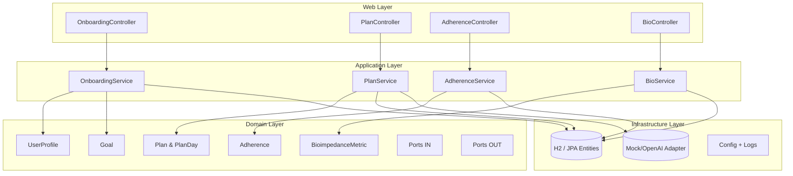
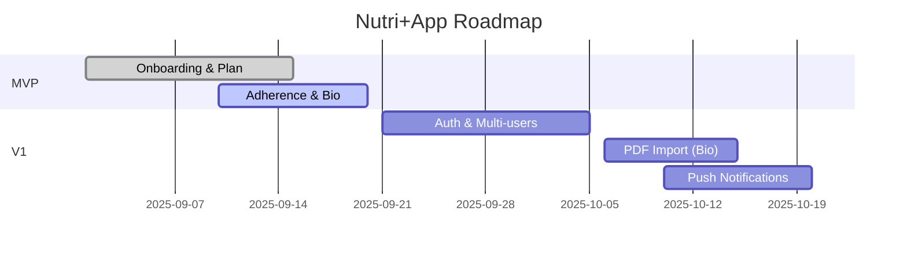

# 🍏 Nutri+App Backend (MVP)

Backend do projeto **Nutri+App**, desenvolvido em **Java 17 + Spring Boot 3** com princípios de **DDD, Clean Architecture e SOLID**.  
Foco em gerar planos alimentares e de treino de forma personalizada, com integração opcional com modelos de linguagem (LLM).

---

## 🚀 Arquitetura



---

## 📂 Estrutura de Pastas

```
src/main/java/br/com/nutriplus
 ├─ domain/        # Modelos e ports (in/out)
 ├─ application/   # Serviços (use cases)
 ├─ infrastructure/
 │   ├─ web/       # Controllers, DTOs, handlers, filtros
 │   ├─ persistence/jpa/ # Entidades + Repositórios
 │   ├─ llm/       # Mock e OpenAI adapters
 │   └─ config/    # Configuração de segurança, CORS, logging
 └─ NutriAppApplication.java
```

---

## ⚙️ Requisitos

- JDK 17+
- Maven 3.9+
- Insomnia ou Postman (para testar)
- (Opcional) OpenAI API Key

---

## ▶️ Como rodar

```bash
mvn clean package
mvn spring-boot:run
```

Endpoints disponíveis:

- Swagger: [http://localhost:8080/swagger-ui/index.html](http://localhost:8080/swagger-ui/index.html)  
- H2 Console: [http://localhost:8080/h2](http://localhost:8080/h2)  
- Health check: [http://localhost:8080/healthz](http://localhost:8080/healthz)

---

## 🌐 Endpoints Principais

### 🔹 Onboarding
```http
POST /onboarding
```
Request:
```json
{
  "name": "Silas",
  "sex": "M",
  "age": 34,
  "heightCm": 178,
  "weightKg": 82.5,
  "trainingDaysPerWeek": 4,
  "dislikes": ["lactose"],
  "style": ["low-carb"],
  "goalType": "fat_loss",
  "pace": "moderate"
}
```
Response:
- `201 Created` + `Location: /users/{id}`

---

### 🔹 Gerar / Consultar Plano
```http
POST /plan/generate?userId={id}
GET  /plan/current?userId={id}
```

---

### 🔹 Adesão diária
```http
POST /adherence/daily?userId={id}
```
Request:
```json
{
  "date": "2025-09-13",
  "mealBreakfast": true,
  "mealLunch": true,
  "mealDinner": false,
  "workout": true,
  "waterMl": 2000
}
```

---

### 🔹 Inserir bioimpedância manual
```http
POST /bio/manual?userId={id}
```
Request:
```json
{
  "reportDate": "2025-09-13",
  "weightKg": 82.1,
  "bodyFatPercent": 18.9,
  "skeletalMuscleMassKg": 37.2,
  "phaseAngleDeg": 6.8,
  "notes": "Relatório importado via PDF"
}
```

---

## 🤖 Integração com LLM

O sistema pode gerar resumos motivacionais diários:

- **Mock (default)**: retorna uma frase estática
- **OpenAI**: configure via variável de ambiente

```bash
export OPENAI_API_KEY=sk-...
mvn spring-boot:run -Dspring-boot.run.arguments=--app.llm.provider=openai
```

---

## 🛠️ Logging

Logs em **JSON estruturado** (Logstash encoder), com `x-request-id` propagado para rastreabilidade:

```json
{
  "@timestamp": "2025-09-13T10:00:00.000Z",
  "level": "INFO",
  "logger": "br.com.nutriplus",
  "thread": "http-nio-8080-exec-1",
  "message": "User onboarded",
  "correlationId": "1a2b3c4d..."
}
```

---

## 📦 Insomnia Collection

Uma coleção pronta está disponível em:
[📥 NutriApp-Insomnia.json](./NutriApp-Insomnia.json)

---

## 🗺️ Roadmap MVP → V1



---

## 👨‍💻 Autores

- **Silas Garcia** — Coordenação & Arquitetura  
- **Nutri+App Coach Persona** — Suporte técnico, nutrição e dev assistido por IA
