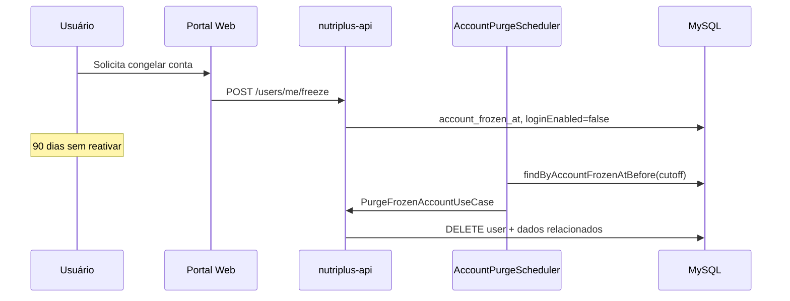

# Ciclo de vida da conta — congelar, reativar e purge

Documentação do fluxo de **congelamento** (soft delete), **reativação** e **purge automático** de contas de usuário.

> **Regras relacionadas:** [RULES_MAP.md](./RULES_MAP.md) (seção Ciclo de vida) · [COMPLIANCE.md](./COMPLIANCE.md) · [SECURITY.md](./SECURITY.md)

---

## Visão geral

| Ação | Endpoint | Efeito | Reversível? |
|------|----------|--------|-------------|
| **Congelar** | `POST /users/me/freeze` | Preserva dados; bloqueia login; cancela renovação MP | Sim (reativar) |
| **Reativar** | `POST /auth/reactivate-account` | Restaura login; emite novos tokens | — |
| **Purge** | Job agendado (90 dias) | Exclusão definitiva de conta congelada | Não |
| **Hard delete** | `DELETE /users/me` | Exclusão imediata solicitada pelo usuário | Não |

Congelar e hard delete exigem **portal web** (`WebPortalClientVerifier`) — não disponíveis no app mobile nativo diretamente.

---

## Congelar conta

### Endpoint

```
POST /users/me/freeze
Authorization: Bearer {token}
Content-Type: application/json

{
  "email": "usuario@email.com",
  "password": "senha-atual"
}
```

Resposta: `204 No Content`

### O que acontece (`FreezeAccountUseCase`)

1. Valida que conta **não** está já congelada.
2. Bloqueia **ADMIN** e nutricionista com **care ACTIVE**.
3. Verifica senha + e-mail (`AccountConfirmationSupport`).
4. Cancela renovação Mercado Pago silenciosamente (se houver).
5. Seta `account_frozen_at = now()`, `loginEnabled = false`.
6. Registra audit `ACCOUNT_FROZEN`.

### Migration V62

```sql
ALTER TABLE users ADD COLUMN account_frozen_at DATETIME NULL;
CREATE INDEX idx_users_account_frozen_at ON users (account_frozen_at);
```

---

## Login com conta congelada

Tentativa de login normal retorna mensagem (`LoginAccessPolicy.FROZEN_MESSAGE`):

> *Sua conta está congelada. Seus dados foram preservados — reative quando quiser voltar ao Nutri+.*

Flow ID sugerido: `account-freeze` (bloqueio) / `account-reactivate` (reativação).

---

## Reativar conta

### Endpoint

```
POST /auth/reactivate-account
Content-Type: application/json

{
  "email": "usuario@email.com",
  "password": "senha-atual"
}
```

Resposta: `AuthResponse` (access + refresh tokens), como login normal.

Implementação: `ReactivateFrozenAccountUseCase` → `UserUpdatePort.reactivateFrozenAccount`.

---

## Purge automático (90 dias)

Job: `AccountPurgeScheduler`

- **Cron:** `${nutriplus.account-purge.cron:0 15 4 * * *}` (04:15 UTC diário)
- **Cutoff:** contas com `account_frozen_at` anterior a **90 dias**
- **Ação:** `PurgeFrozenAccountUseCase.execute(user)` — exclusão definitiva



---

## Hard delete vs congelar

| | Congelar | Hard delete |
|---|----------|-------------|
| **Quando usar** | Pausa temporária; dados preservados | Exclusão LGPD imediata |
| **Endpoint** | `POST /users/me/freeze` | `DELETE /users/me` |
| **Portal web** | Obrigatório | Obrigatório |
| **Login** | Bloqueado até reativar | Conta removida |
| **Assinatura** | Renovação cancelada | — |
| **Purge auto** | Após 90 dias | N/A |

---

## Impacto LGPD / compliance

Atualizar checklist em [COMPLIANCE.md](./COMPLIANCE.md):

- Direito de exclusão: hard delete **e** purge após congelamento prolongado.
- Direito de portabilidade: dados preservados durante congelamento (até purge).
- Nutricionista: encerrar care antes de congelar.

---

## Clientes

| Cliente | Suporte |
|---------|---------|
| **Portal web** | UI de congelar/excluir em configurações de conta |
| **Flutter app** | Mensagem no login se congelada; reativação via endpoint auth |
| **API** | Fonte de verdade |

---

## Arquivos principais

| Arquivo | Função |
|---------|--------|
| `FreezeAccountUseCase.java` | Lógica de congelamento |
| `ReactivateFrozenAccountUseCase.java` | Reativação + tokens |
| `PurgeFrozenAccountUseCase.java` | Exclusão definitiva |
| `AccountPurgeScheduler.java` | Job 90 dias |
| `LoginAccessPolicy.java` | Mensagem FROZEN no login |
| `UserController.java` | Endpoints `/me/freeze`, `/me` delete |
| `AuthController.java` | `/auth/reactivate-account` |
| `V62__account_frozen.sql` | Schema |
