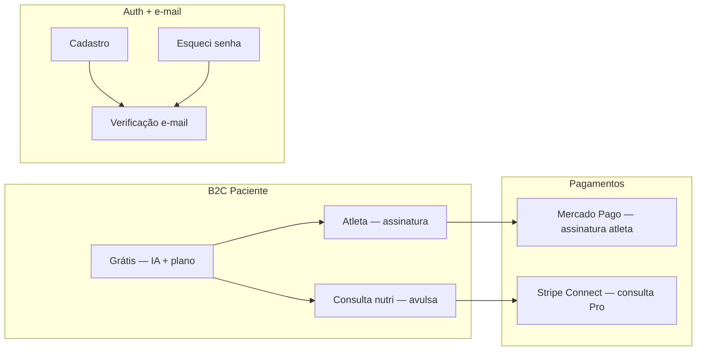

# Nutri+ — Plano: planos, e-mail e Mercado Pago

Roadmap de implementação para **monetização B2C (assinatura)**, **autenticação por e-mail** e **pagamentos Mercado Pago** — web + mobile.

> **Decisões de produto já documentadas:** [PRICING.md](./PRICING.md), [BUSINESS_MODEL.md](./BUSINESS_MODEL.md)  
> **Estado atual:** consulta nutricionista via **Stripe Connect** (mock em dev); **modo atleta grátis**; auth só register/login/refresh; **sem** e-mail transacional nem reset de senha.

---

## 1. Visão geral



| Canal | Produto | Gateway | Status |
|-------|---------|---------|--------|
| App + Web paciente | **Grátis** | — | ✅ |
| App + Web paciente | **Modo atleta** (mensal/anual) | **Mercado Pago** | ⏳ este plano |
| App + Web paciente | **Consulta nutricionista** | Stripe (já existe) | ✅ mock / Connect |
| Portal Pro | Taxa % sobre consulta | Stripe | ✅ |

**Por que Mercado Pago no B2C:** Pix + cartão + recorrência nativa no BR; vocês já têm credenciais e código de referência em outro app — replicar adapter + webhooks aqui.

**Stripe permanece** no marketplace nutricionista (Connect, split, repasse profissional). Não misturar gateways no mesmo fluxo sem necessidade.

---

## 2. Catálogo de planos (o que exibir no app)

Valores comerciais sugeridos em [PRICING.md](./PRICING.md) — fechar um número antes de codar `plan_catalog`.

| Plano | ID técnico | Preço sugerido | O que desbloqueia |
|-------|------------|----------------|-------------------|
| **Grátis** | `FREE` | R$ 0 | IA, plano, check-ins, evolução, onboarding completo |
| **Atleta mensal** | `ATHLETE_MONTHLY` | R$ 24,90/mês | Modo atleta, treinos, MET, apply macros, Garcia interno |
| **Atleta anual** | `ATHLETE_YEARLY` | R$ 199/ano (~R$ 16,50/mês) | Idem mensal |
| **Consulta nutri** | `CONSULTATION` | R$ 49–149 (nutri define) | Chat + revisão humana (já modelado) |

### Onde mostrar preço (UX)

| Superfície | Conteúdo |
|------------|----------|
| Landing web | Seção “Planos” com Grátis / Atleta / Consulta |
| Onboarding atleta | Paywall antes de ativar modo atleta (ou trial 7 dias — decisão) |
| Perfil → Modo atleta | Card “Assinar” se não ativo |
| Perfil → Assinatura | Status, renovação, cancelar, nota fiscal (fase 2) |
| Web portal `/portal/planos` | Mesmo catálogo + checkout MP |
| Flutter | Tela `SubscriptionScreen` + deep link pós-pagamento |

---

## 3. Fase A — E-mail transacional (cadastro + reset)

**Prioridade:** alta — prerequisito de confiança e recuperação de conta.

### 3.1 Provedor (escolher um)

| Opção | Prós | Uso típico |
|-------|------|------------|
| **Resend** | API simples, templates HTML | Startup, volume médio |
| **Amazon SES** | Barato em escala | Se já usam AWS |
| **SendGrid / Mailgun** | Maduro, analytics | Replica do outro app se já usam |

Recomendação: **usar o mesmo provedor do outro app** para reaproveitar domínio verificado (SPF/DKIM) e templates.

### 3.2 API — entidades e endpoints

**Migration `Vxx__email_auth.sql`:**

```sql
-- users: email_verified_at, password_reset_token_hash, password_reset_expires_at
-- email_verification_tokens (user_id, token_hash, expires_at, consumed_at)
-- password_reset_tokens (idem)
-- opcional: email_outbox (auditoria / retry)
```

**Endpoints novos:**

| Método | Rota | Descrição |
|--------|------|-----------|
| `POST` | `/auth/verify-email/request` | Reenvia link (autenticado ou e-mail no body) |
| `GET` | `/auth/verify-email?token=` | Confirma e-mail → redirect app/web |
| `POST` | `/auth/forgot-password` | `{ "email" }` — sempre 204 (anti-enumeration) |
| `POST` | `/auth/reset-password` | `{ "token", "newPassword" }` |

**Regras:**

- Token opaco UUID, hash bcrypt/SHA-256 no banco, TTL **1 h** (reset) / **24 h** (verify).
- Rate limit por IP + e-mail (já existe infra de lockout — estender).
- Em **prod**, opcional: bloquear features sensíveis até `email_verified_at` (fase soft: banner “Confirme seu e-mail”).

**Serviço:** `EmailService` + `EmailTemplateRenderer` (HTML PT-BR).

**Templates mínimos:**

1. Boas-vindas + link verificação  
2. Redefinir senha  
3. (Futuro) Assinatura confirmada / falha de pagamento  

**Env vars:**

```bash
EMAIL_PROVIDER=resend          # ou ses, sendgrid
EMAIL_API_KEY=
EMAIL_FROM=noreply@nutriplus.com.br
EMAIL_VERIFY_BASE_URL=https://nutriplus.com.br/auth/verify
EMAIL_RESET_BASE_URL=https://nutriplus.com.br/auth/reset
```

### 3.3 Clientes

| Repo | Entrega |
|------|---------|
| **nutriplus-web** | `/auth/esqueci-senha`, `/auth/redefinir-senha`, banner pós-cadastro |
| **nutriplus-frontend** | Telas equivalentes + deep link `nutriplus://reset?token=` |
| **nutriplus-api** | Implementação + testes integração (MockWebServer ou stub) |

---

## 4. Fase B — Assinaturas + Mercado Pago

### 4.1 Modelo de dados

**Migration `Vxx__subscriptions.sql`:**

```sql
subscription_plans (
  id, code, name, price_cents, currency, interval,  -- MONTHLY | YEARLY
  mercado_pago_plan_id, active, features_json
)

user_subscriptions (
  id, user_id, plan_id, status,  -- TRIAL | ACTIVE | PAST_DUE | CANCELED | EXPIRED
  mercado_pago_subscription_id, mercado_pago_payer_id,
  current_period_start, current_period_end,
  canceled_at, created_at
)

subscription_payments (
  id, user_subscription_id, mercado_pago_payment_id,
  amount_cents, status, paid_at
)
```

**Regra de produto:** `athleteModeEnabled` só `true` se subscription `ACTIVE` (ou trial). Hoje o flag vem só do perfil — passar a derivar de `user_subscriptions` com cache no JWT ou consulta em `/users/me`.

### 4.2 Mercado Pago — fluxo (replicar do outro app)

1. **Backend** cria preferência / assinatura via SDK Java (`com.mercadopago:sdk-java`).
2. **Web:** Checkout Pro ou **Subscription** em iframe/redirect → `back_urls` + `notification_url`.
3. **Mobile:**  
   - **Android/iOS:** WebView ou **Mercado Pago SDK** + `init_point` retornado pela API.  
   - Deep link `nutriplus://subscription/success` / `failure`.
4. **Webhook** `POST /webhooks/mercadopago` — idempotente, valida assinatura, atualiza `user_subscriptions`.

**Endpoints API:**

| Método | Rota | Descrição |
|--------|------|-----------|
| `GET` | `/subscriptions/plans` | Catálogo público |
| `GET` | `/subscriptions/me` | Assinatura atual do usuário |
| `POST` | `/subscriptions/checkout` | `{ "planCode": "ATHLETE_MONTHLY" }` → `{ initPoint, subscriptionId }` |
| `POST` | `/subscriptions/cancel` | Cancela ao fim do período |
| `POST` | `/webhooks/mercadopago` | Notificações IPN |

**Env vars (mesmas credenciais do outro app, ambientes separados):**

```bash
MERCADOPAGO_ACCESS_TOKEN=        # prod vs test
MERCADOPAGO_PUBLIC_KEY=          # front/mobile
MERCADOPAGO_WEBHOOK_SECRET=      # se usar assinatura
MERCADOPAGO_NOTIFICATION_URL=https://api.nutriplus.com.br/webhooks/mercadopago
MERCADOPAGO_BACK_URL_SUCCESS=https://nutriplus.com.br/portal/planos?status=success
MERCADOPAGO_BACK_URL_FAILURE=https://nutriplus.com.br/portal/planos?status=failure
MERCADOPAGO_MOCK_MODE=true       # dev: ativa plano sem MP
```

### 4.3 Paywall modo atleta

| Gatilho | Comportamento |
|---------|---------------|
| Toggle “Modo atleta” sem assinatura | Abre sheet/tela de planos |
| `POST /training/apply` | 402 se não ativo |
| Onboarding atleta | Step final = escolher plano ou “Continuar grátis” (só perfil normal) |

**Trial (opcional):** 7 dias `TRIAL` — decidir antes de implementar webhook de expiração.

### 4.4 Contrato / termos

- Aceite de **Termos de Uso** + **Política de assinatura** no checkout (checkbox, timestamp em `user_subscriptions` ou tabela `legal_acceptances` — já existe padrão no onboarding).
- Texto canônico: atualizar [TERMS_OF_USE.md](./legal/TERMS_OF_USE.md) com seção “Assinaturas e cancelamento” (direito de arrependimento 7 dias CDC, renovação automática, como cancelar).

---

## 5. Fase C — UI web + mobile

### nutriplus-web

| Item | Rota / componente |
|------|-------------------|
| Página planos marketing | `/planos` na landing |
| Checkout | `/portal/planos` (autenticado) |
| Gestão assinatura | `/portal/assinatura` |
| Auth e-mail | `/auth/esqueci-senha`, `/auth/redefinir-senha` |
| MP public key | `environment.mercadoPagoPublicKey` |

### nutriplus-frontend (Flutter)

| Item | Arquivo sugerido |
|------|------------------|
| Planos + preços | `lib/src/features/subscription/presentation/plans_screen.dart` |
| Checkout WebView / MP | `subscription_checkout_screen.dart` |
| Provider estado | `subscription_provider.dart` |
| Paywall atleta | Integrar em `training_profile_screen.dart` |
| Deep links | `android/ios` intent filters + `go_router` |

---

## 6. Ordem de execução recomendada

| Sprint | Entrega | Depende de |
|--------|---------|------------|
| **S1** | E-mail: forgot/reset + verify cadastro + telas web/mobile | Provedor + domínio DNS |
| **S2** | DB planos + `GET /subscriptions/plans` + landing “Planos” | Preço fechado |
| **S3** | Mercado Pago checkout + webhook + mock mode | Credenciais test MP |
| **S4** | Paywall atleta API + Flutter + web portal | S3 |
| **S5** | Cancelamento, past_due, e-mail “pagamento falhou” | S1 + S3 |
| **S6** | Homolog MP produção + revisão legal assinatura | Conta MP produção |

---

## 7. Checklist antes de ir para produção

- [ ] Domínio e-mail verificado (SPF, DKIM, DMARC)
- [ ] Mercado Pago: app prod, webhook HTTPS, credenciais no Railway
- [ ] Termos de assinatura revisados (jurídico)
- [ ] `MERCADOPAGO_MOCK_MODE=false` e `STRIPE_MOCK_MODE=false` só em prod
- [ ] Testes: cadastro → verify → assinar → webhook → atleta ativo → cancelar
- [ ] Observabilidade: métricas `subscription_checkout_started`, `subscription_activated`, `payment_webhook_failed`

---

## 8. O que NÃO entra neste plano (Fase 3+)

- Vouchers / preço por região ([PRICING.md](./PRICING.md) Fase 3)
- Nota fiscal automática (eNotas, Omie, etc.)
- Apple/Google IAP (só se exigirem para digital goods na loja — avaliar guideline 3.1.1)
- Migrar consulta nutri de Stripe para MP (manter Stripe Connect no Pro)

---

## 9. Referência rápida — arquivos existentes a estender

| Área | Onde está hoje |
|------|----------------|
| Preços / tiers | `docs/PRICING.md` |
| Pagamento consulta | `StripePaymentService.java`, `CareController` |
| Auth | `AuthController.java`, `AuthService.java` |
| Troca senha (logado) | `ChangePasswordUseCase.java`, `UserController` |
| Modo atleta | `TrainingService.java`, `training_profile_screen.dart` |
| Termos | `terms_acceptance_screen.dart`, `legal/TERMS_OF_USE.md` |

---

*Última atualização: jun/2026 — alinhado ao pedido de plano com custos, e-mail, Mercado Pago e contrato web/mobile.*
