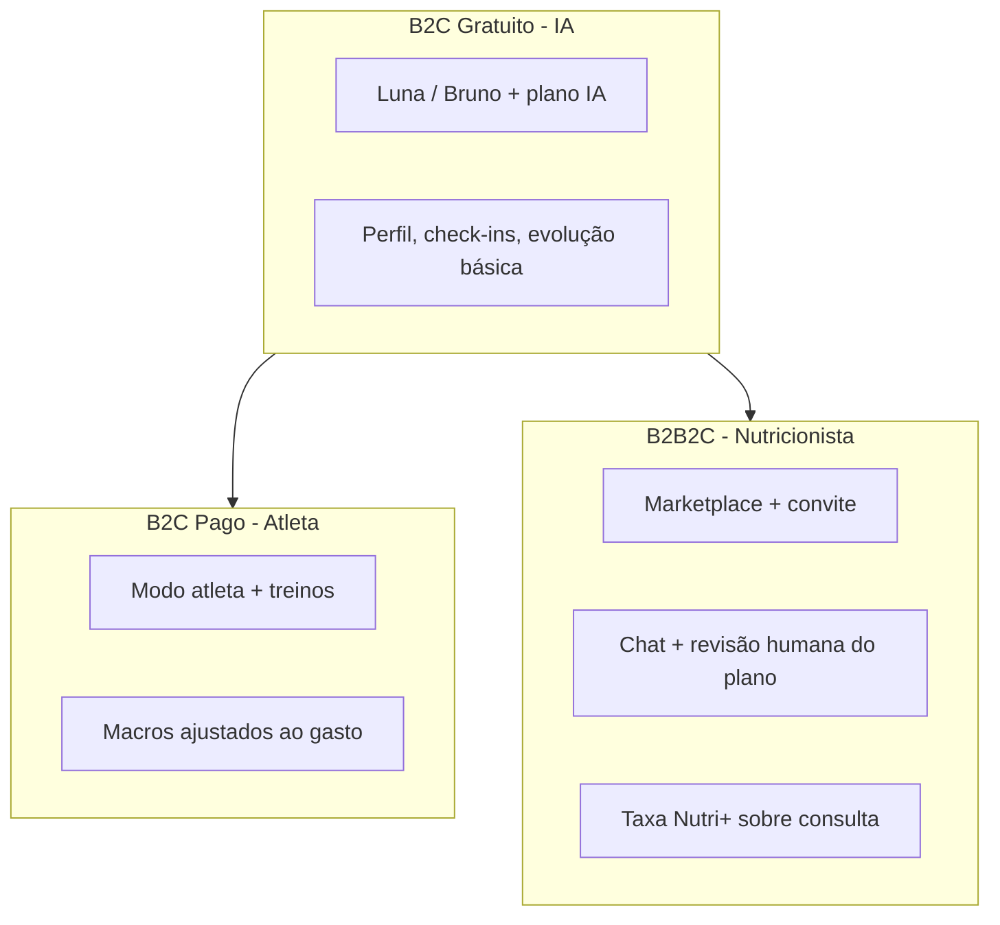

# Nutri+ — Modelo de negócio

Documento de referência para produto, engenharia e parceiros. Descreve **como o Nutri+ ganha dinheiro**, **para quem** e **quais regras** governam cada camada.

> **Status:** modelo validado em conceito; valores finais de assinatura atleta e percentual definitivo da plataforma ficam para decisão comercial (ver [PRICING.md](./PRICING.md)).

---

## 1. Visão em uma frase

O Nutri+ é um app **B2C gratuito com IA** que organiza alimentação do dia a dia, com **upgrade pago** para modo atleta e **upgrade humano opcional** via marketplace de nutricionistas — onde a plataforma monetiza uma **taxa sobre o profissional**, não sobre o paciente de forma oculta.

---

## 2. Três camadas de valor

| Camada | Quem paga | Quem recebe | Papel do Nutri+ |
|--------|-----------|-------------|-----------------|
| **Gratuito (IA)** | Ninguém | — | Aquisição, retenção, impacto social |
| **Atleta** | Paciente (assinatura) | Nutri+ | Feature premium B2C |
| **Nutricionista** | Paciente → repasse ao nutri | Nutricionista (− taxa Nutri+) | Marketplace + infra + pagamento |

---

## 3. Por que esse modelo faz sentido

### 3.1 Proposta clara por persona

| Persona | Dor | Solução Nutri+ | Monetização |
|---------|-----|----------------|-------------|
| **Baixa renda / curioso** | Não pode pagar nutri | IA + plano + check-ins grátis | Indireta (futuro: patrocínio, volume) |
| **Praticante de esporte** | Precisa alinhar dieta ao treino | Modo atleta | Assinatura mensal |
| **Quem quer humano** | IA não basta / quer CRN | Contratar nutricionista no app | Taxa % sobre consulta |
| **Nutricionista** | Captação + prontuário + pagamento | Portal Pro + pacientes pré-engajados | Taxa % (custo de aquisição + tech) |

### 3.2 IA primeiro, humano depois (sem conflito)

- O app **nunca exige** nutricionista para funcionar.
- A IA responde dúvidas e gera planos no dia a dia.
- O nutricionista é **upgrade explícito** — alinhado ao disclaimer legal (“busque ajuda de um profissional”).
- Isso evita que o profissional veja o app como ameaça: ele ganha **pacientes que já chegam com dados** (convite pré-consulta).

### 3.3 Dois fluxos de receita independentes

1. **B2C (atleta):** previsível, recorrente, baixo ticket.
2. **B2B2C (nutri):** variável, atrelado a consultas, ticket maior por transação.

Não competem entre si: públicos e momentos de uso diferentes.

---

## 4. Mercado brasileiro (referência 2024–2026)

### 4.1 Consulta com nutricionista

| Canal | Faixa típica | Observação |
|-------|--------------|------------|
| Presencial (capitais) | R$ 150 – R$ 400 | Primeira consulta + retornos |
| Online / teleconsulta | R$ 80 – R$ 200 | Cresce pós-pandemia |
| Popular / acessível | R$ 49 – R$ 120 | Clínicas populares, promoções |
| SUS | Gratuito | Fila, acesso limitado |

**Posicionamento Nutri+ Pro:** faixa **R$ 49 – R$ 149** por consulta avulsa (configurável em `pricing_guidelines`), sugerido **R$ 79**. Isso coloca o marketplace na **parte acessível** do mercado privado, sem competir com consultório premium.

### 4.2 Apps de nutrição (B2C)

| App | Modelo | Referência de preço BR |
|-----|--------|------------------------|
| Lifesum / Yazio / similar | Freemium + premium | ~R$ 25 – R$ 45/mês |
| MyFitnessPal | Freemium + premium | ~R$ 30 – R$ 40/mês |
| Planos com nutri humano | Assinatura + consultas | R$ 80 – R$ 300/mês (TeleNutri, etc.) |

**Implicação:** assinatura **atleta** entre **R$ 19,90 e R$ 29,90/mês** é competitiva para baixa renda digital (classe C) que já paga streaming ou apps de fitness.

### 4.3 Marketplaces de saúde

| Plataforma | Taxa sobre profissional | O que oferece |
|------------|-------------------------|---------------|
| Doctoralia / similares | ~15–25% ou assinatura do profissional | Agenda + visibilidade |
| iFood / Rappi (analogia) | 12–27% | Logística + pagamento |
| **Nutri+ Pro (MVP)** | **15%** (default técnico) | Dados pré-consulta + app + pagamento + chat |

**15% é razoável** se o nutricionista recebe paciente **pré-engajado** (já usou app, tem peso, check-ins, plano IA). O valor da plataforma não é só “agendar”: é **dossiê pronto** + canal digital contínuo.

---

## 5. Acessibilidade / baixa renda

Princípios de produto (não negociáveis):

1. **Versão gratuita completa o suficiente** para organizar alimentação — IA, plano, check-ins, evolução básica.
2. **Bioimpedância nunca obrigatória** — estimativa por peso/medidas funciona; bio só melhora precisão.
3. **Consulta humana com teto de preço** — nutricionista escolhe dentro da faixa; plataforma pode destacar “preço acessível”.
4. **Convite do nutricionista** — paciente usa app grátis antes de pagar; consulta mais produtiva = menos retornos pagos.
5. **Modo atleta é premium** — quem treina seriamente paga; quem só quer emagrecer com IA não precisa.

Programas futuros (fora do MVP):

- Parcerias com CRN-regionais ou clínicas populares
- Vouchers / subsídio de consulta (empresa, governo local)
- “Nutricionista social” com preço fixo R$ 49 e maior visibilidade

---

## 6. Fluxos de receita (implementados vs planejados)

| Receita | Status técnico | Quem paga |
|---------|----------------|-----------|
| Taxa % sobre consulta nutri | ✅ MVP (`platform_fee_percent`, Stripe Connect) | Descontada do repasse ao nutricionista |
| Consulta avulsa paciente → nutri | ✅ MVP (mock Stripe + Connect) | Paciente |
| Assinatura modo atleta | ⏳ Regra de produto; **ainda grátis no app** | Paciente |
| Assinatura paciente “com nutricionista” | 📋 Fase 2 (Stripe Billing mensal) | Paciente |
| Anúncios / B2B corporativo | 📋 Futuro | Empresa |

---

## 7. Validação do modelo (análise)

### Pontos fortes

- **Freemium + marketplace** é padrão de mercado validado (apps de saúde, Doctoralia, iFood).
- **Dupla monetização** (atleta B2C + taxa B2B2C) diversifica receita sem cobrar duas vezes o mesmo usuário na mesma jornada.
- **Nutricionista como parceiro**, não concorrente da IA — reduz resistência profissional.
- **Faixa R$ 49–149** + app grátis = narrativa forte para **inclusão**.

### Riscos e mitigação

| Risco | Mitigação |
|-------|-----------|
| IA “substitui” consulta | Copy legal + CTA humano; plano IA ≠ plano revisado por nutri |
| Nutricionista não adere | Dossiê pré-consulta, convite, receita no portal, preço que ele controla (dentro da faixa) |
| Margem baixa na taxa 15% | Volume; serviços premium pro (relatórios, agenda); assinatura atleta B2C compensa |
| Churn após 30 dias de chat | Fase 2: renovação/assinatura; nutri incentiva retorno |
| Custo de IA (Groq/OpenAI) | Limites no free tier; atleta paga infra; cache/mock em dev |

### Conclusão

**Sim, o modelo é válido** para o mercado brasileiro se:

1. O **gratuito** permanecer generoso o suficiente para retenção e missão social.
2. O **atleta** tiver preço de entrada (~R$ 20–30/mês), não de consultório.
3. A **taxa ao nutricionista** (10–20%) for transparente e justificada por dados + pagamento + pacientes qualificados.
4. A **consulta humana** ficar na faixa acessível, com nutricionista definindo preço dentro do teto.

---

## 8. Comunicação de produto

### 8.1 Landing B2C (GitHub Pages)

Site público em `docs/legal/site/index.html`:

| Seção | Mensagem |
|-------|----------|
| Hero | Luna/Bruno grátis; nutricionista opcional para especializar |
| IA | Assistentes gratuitos — plano, check-ins, evolução |
| Atleta | Premium futuro (~R$ 20–30/mês) |
| Nutricionista | Marketplace + convite; revisão humana do plano |
| Modalidade | Online (longe) ou presencial (perto) ou híbrido |
| Canais | Chat no app (oficial); video/WhatsApp combinado com o profissional |

URLs: `/` (landing), `/privacidade.html`, `/termos.html`. App referencia `landingUrl` em `constants.dart`.

### 8.2 Narrativa em três degraus

1. **Grátis (IA → C):** Luna/Bruno auxiliam no dia a dia — nunca bloqueiam upgrade humano.
2. **Atleta (C → Nutri+):** assinatura para quem treina com regularidade.
3. **Nutricionista (C → Nutri → Nutri+ %):** humano especializado; taxa descontada do profissional.

### 8.3 WhatsApp e video

- **Chat in-app** é o canal oficial (LGPD, histórico, período de acompanhamento).
- **WhatsApp** e **video** (Meet/Zoom) são complementos combinados após contratação — link `wa.me` opcional no perfil do nutricionista, visível só com vínculo `ACTIVE`.

---

## 9. Documentos relacionados

| Documento | Conteúdo |
|-----------|----------|
| [PRICING.md](./PRICING.md) | Tiers, faixas, benchmarks, defaults técnicos |
| [NUTRI_PLUS_PRO.md](./NUTRI_PLUS_PRO.md) | Regras de negócio do marketplace nutricionista |
| [TRAINING_MODE.md](./TRAINING_MODE.md) | Modo atleta (feature premium planejada) |
| [legal/DATA_SHARING_CONSENT.md](../src/main/resources/legal/DATA_SHARING_CONSENT.md) | Consentimento LGPD paciente → nutri |
| [legal/NUTRITIONIST_TERMS.md](../src/main/resources/legal/NUTRITIONIST_TERMS.md) | Termos do profissional |

---

## 9. Decisões pendentes (comercial)

Registrar aqui quando definido:

- [ ] Preço mensal **Modo Atleta** (sugestão: R$ 19,90 – R$ 29,90)
- [ ] **Percentual final** da plataforma sobre consulta (MVP: 15%)
- [ ] Duração padrão do acompanhamento incluso na consulta (MVP: 30 dias)
- [ ] Assinatura mensal paciente ↔ nutricionista (Fase 2)
- [ ] Trial / desconto primeira consulta para baixa renda
