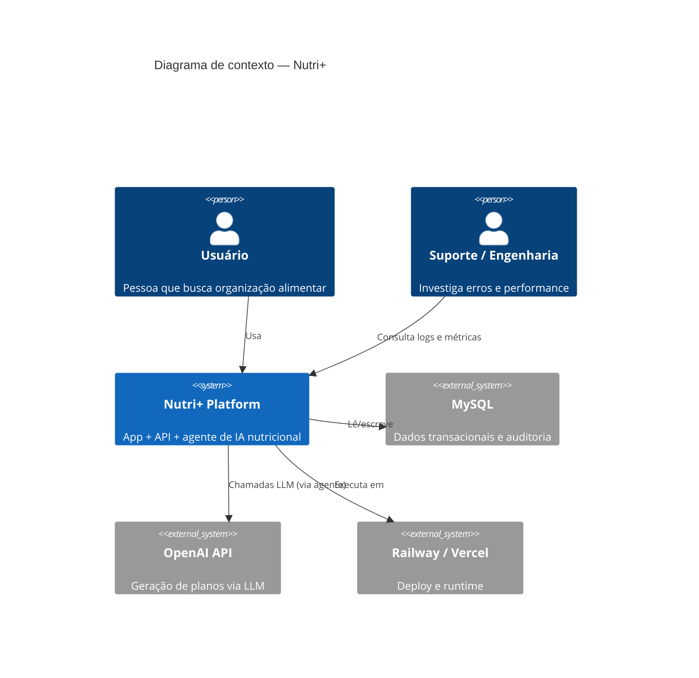
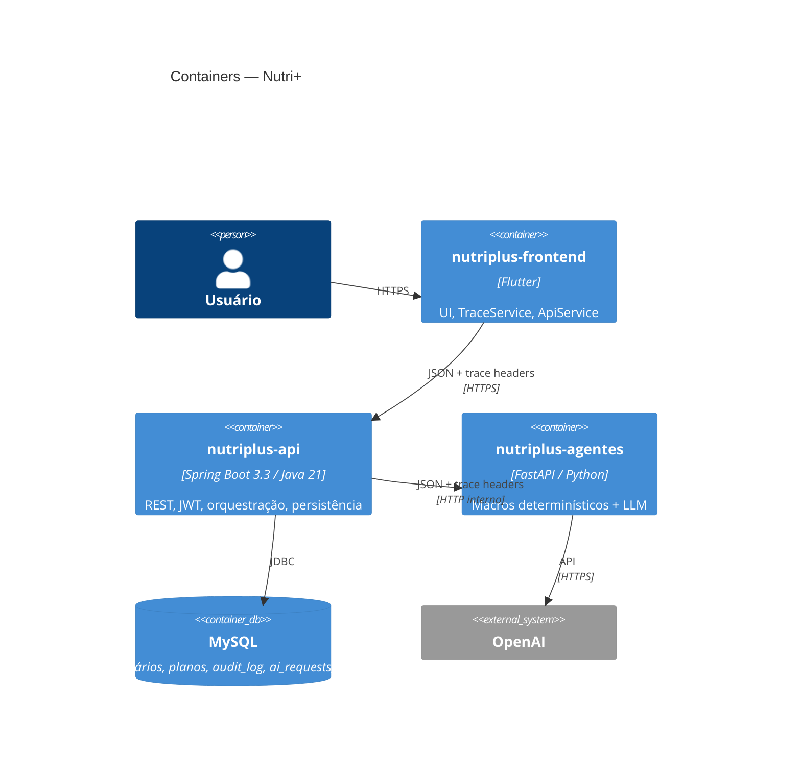
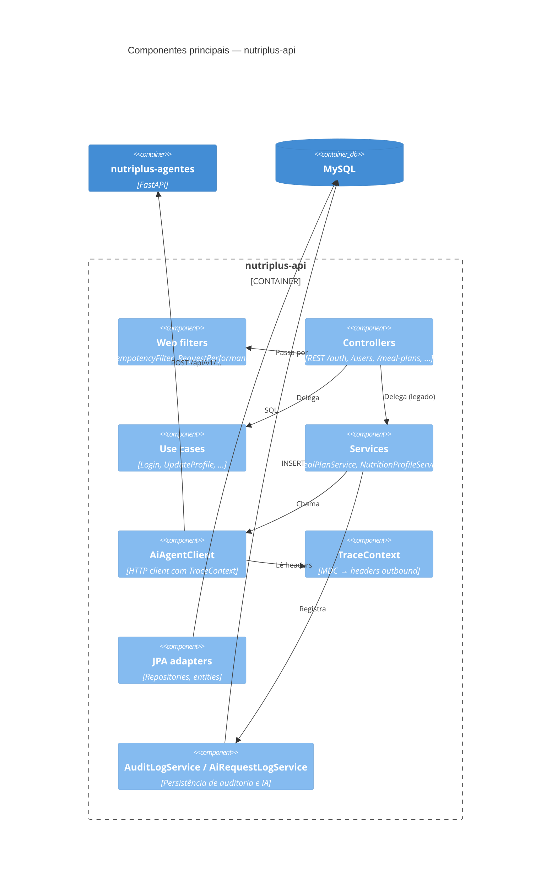
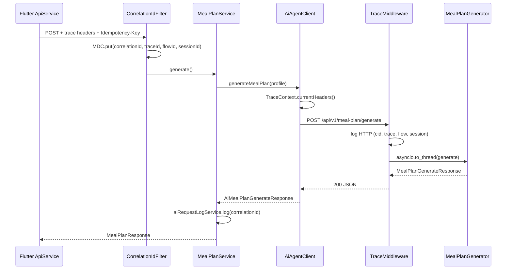

# Nutri+ — Modelo C4

Documentação de arquitetura no padrão [C4 Model](https://c4model.com/): **visão de produto** (o que o sistema entrega) e **visão técnica** (como os serviços se organizam).

> **Manutenção:** ao alterar fluxos, trace, segurança ou integrações entre repositórios, atualize este arquivo e [`OBSERVABILITY.md`](./OBSERVABILITY.md).

---

## Visão de produto

### O que é o Nutri+

Plataforma de apoio nutricional que ajuda o usuário a:

1. Criar conta e manter perfil (incluindo foto).
2. Onboarding em wizard: escolher assistente (**Luna** ou **Bruno**), informar gostos alimentares e métricas corporais.
3. Receber metas de macros calculadas de forma determinística.
4. Gerar plano alimentar semanal e lista de compras com apoio de IA.
5. Consultar histórico do plano e da lista.

O produto **não substitui** um nutricionista; as recomendações de IA vêm com disclaimer explícito.

### Personas e sistemas externos

| Ator / sistema | Papel |
|----------------|-------|
| **Usuário final** | Usa o app Flutter (mobile/web). |
| **Equipe de suporte / engenharia** | Investiga incidentes usando IDs de correlação nos logs. |
| **MySQL** | Persistência de usuários, perfis, planos, auditoria e log de chamadas IA. |
| **Groq / OpenAI** | LLM usado pelo agente (Luna/Bruno) para montar planos quando `USE_MOCK_LLM=false`. |
| **Railway / Vercel** | Hospedagem da API, agente e frontend. |

### Jornadas de negócio (Flow IDs)

O app etiqueta cada ação com `X-Flow-Id` para linguagem de produto nos logs:

| Flow ID | Jornada |
|---------|---------|
| `register` | Cadastro |
| `login` | Login |
| `refresh-token` | Renovação de sessão |
| `onboarding-metrics` | Salvar perfil nutricional (wizard) |
| `onboarding-agent` | Escolha Luna/Bruno (wizard) |
| `onboarding-preferences` | Gostos alimentares (wizard) |
| `generate-meal-plan` | Gerar plano alimentar |
| `update-profile` | Atualizar nome/foto |
| `change-password` | Troca de senha |

Com isso, suporte consegue filtrar logs por **ação de produto**, não só por URL.

### Valor da observabilidade para o produto

| Necessidade | Como o trace atende |
|-------------|---------------------|
| “Deu erro ao gerar plano” | `correlationId` no erro do app + mesmo ID nos logs da API e do agente |
| “Usuário travou no onboarding” | `sessionId` + `flowId=onboarding` em toda a sessão do app |
| Conformidade / auditoria | `audit_log` e `ai_requests_log` com `correlationId` |
| SLA de IA | Métricas `nutriplus.ai.agent.*` e duração de geração de plano |

---

## Nível 1 — Diagrama de contexto (System Context)



**Visão técnica resumida:** o usuário interage só com o frontend. A API é o ponto de entrada autenticado; o agente é um serviço interno chamado pela API, não exposto diretamente ao app.

---

## Nível 2 — Diagrama de containers (Container)



### Responsabilidades por container

| Container | Repositório | Responsabilidade principal |
|-----------|-------------|----------------------------|
| Frontend | `nutriplus-frontend` | UX, tokens seguros, envio de headers de trace |
| API | `nutriplus-api` | Auth, regras de negócio, persistência, propagação de trace |
| Agente | `nutriplus-agentes` | Cálculo de macros e geração de plano (mock ou OpenAI) |
| MySQL | — | Fonte única de verdade transacional |

### Propagação de trace (container → container)

```
Flutter  ──[X-Correlation-Id, X-Trace-Id, X-Flow-Id, X-Session-Id]──►  API  ──[mesmos headers]──►  Agente
```

Detalhes em [`OBSERVABILITY.md`](./OBSERVABILITY.md).

---

## Nível 3 — Componentes (API)



### Componentes de trace na API

| Componente | Arquivo | Função |
|------------|---------|--------|
| `CorrelationIdFilter` | `infrastructure/web/CorrelationIdFilter.java` | Entrada HTTP: resolve/gera IDs, MDC, ecoa na resposta |
| `IdempotencyFilter` | `infrastructure/web/IdempotencyFilter.java` | Dedup mutações via `Idempotency-Key` + `idempotency_keys` |
| `RequestPerformanceFilter` | `infrastructure/web/RequestPerformanceFilter.java` | Duração; warn em requests lentos |
| `MdcUserFilter` | `infrastructure/web/MdcUserFilter.java` | `userId` no MDC (rotas autenticadas) |
| `TraceContext` | `infrastructure/web/TraceContext.java` | Exporta MDC (incl. idempotency) para chamadas HTTP saída |
| `AiAgentClient` | `client/AiAgentClient.java` | Propaga headers ao agente |
| `ApiExceptionHandler` | `infrastructure/web/ApiExceptionHandler.java` | `correlationId` / `traceId` no JSON de erro |

---

## Nível 3 — Componentes (Agente)

| Componente | Arquivo | Função |
|------------|---------|--------|
| `TraceMiddleware` | `app/trace_middleware.py` | Log HTTP com cid/trace/flow/session; métricas Prometheus |
| `MealPlanGenerator` | `app/meal_plan_generator.py` | LLM ou mock (logs internos — ver limitações em OBSERVABILITY) |
| `nutrition_engine` | `app/nutrition_engine.py` | Macros determinísticos |
| `main` | `app/main.py` | Rotas FastAPI, lifespan, `/health`, `/metrics` |

---

## Nível 3 — Componentes (Frontend)

| Componente | Arquivo | Função |
|------------|---------|--------|
| `TraceService` | `lib/services/trace_service.dart` | `sessionId` persistente; gera cid/trace por request |
| `ApiService` | `lib/services/api_service.dart` | Injeta headers; `flowId` por endpoint |
| `AuthProvider` | `lib/providers/auth_provider.dart` | `initTrace()` no boot |

Documentação detalhada: `nutriplus-frontend/docs/ARCHITECTURE.md`.

---

## Nível 4 — Código (caminho crítico: gerar plano)

Sequência simplificada para `POST /meal-plans/generate`:



---

## Estados de maturidade (honestidade de produto)

| Capacidade | Status | Notas |
|------------|--------|-------|
| Trace por request HTTP (FE → API → agente) | Implementado | Headers + MDC + middleware |
| Idempotency-Key (mutações) | Implementado | API filter + DB; local desligado |
| Flow ID por ação de produto | Implementado | Todos os métodos do `ApiService` |
| Erro com `correlationId` para o usuário | Implementado | JSON de erro da API |
| Logs JSON em prod (API) | Implementado | `logback-spring.xml` + LogstashEncoder |
| Trace em logs internos do LLM (agente) | Parcial | Worker thread sem contexto |
| Personas Luna/Bruno + Groq | Implementado | `config/agents.yaml` + prompts |
| Onboarding wizard (persona + gostos + métricas) | Implementado | Flutter 3 telas |
| Usuário de teste local | Implementado | `teste@nutriplus.local` / `Nutri123!` |
| Trace estável em retry 401 (app) | Implementado | Headers reutilizados no `_authorized` |
| `ai_requests_log` com trace/flow/session | Parcial | Só `correlationId` hoje |
| OpenTelemetry / W3C `traceparent` | Não implementado | Roadmap |

Roadmap técnico detalhado: [`OBSERVABILITY.md`](./OBSERVABILITY.md#roadmap).

---

## Documentos relacionados

| Documento | Escopo |
|-----------|--------|
| [`ARCHITECTURE.md`](./ARCHITECTURE.md) | Clean Architecture, packages, bounded contexts |
| [`OBSERVABILITY.md`](./OBSERVABILITY.md) | Trace, logs, métricas, auditoria |
| [`SECURITY.md`](./SECURITY.md) | JWT, rate limit, lockout |
| [`DEPLOYMENT.md`](./DEPLOYMENT.md) | Railway, variáveis de ambiente |
| `nutriplus-agentes/docs/architecture.md` | Visão do agente |
| `nutriplus-frontend/docs/ARCHITECTURE.md` | Visão do app |
