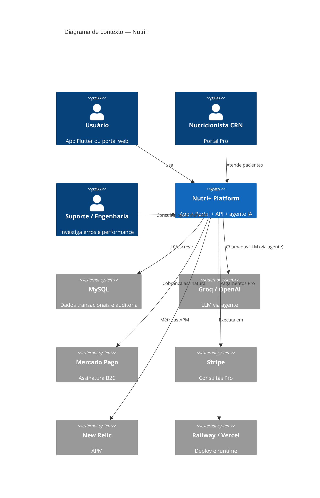
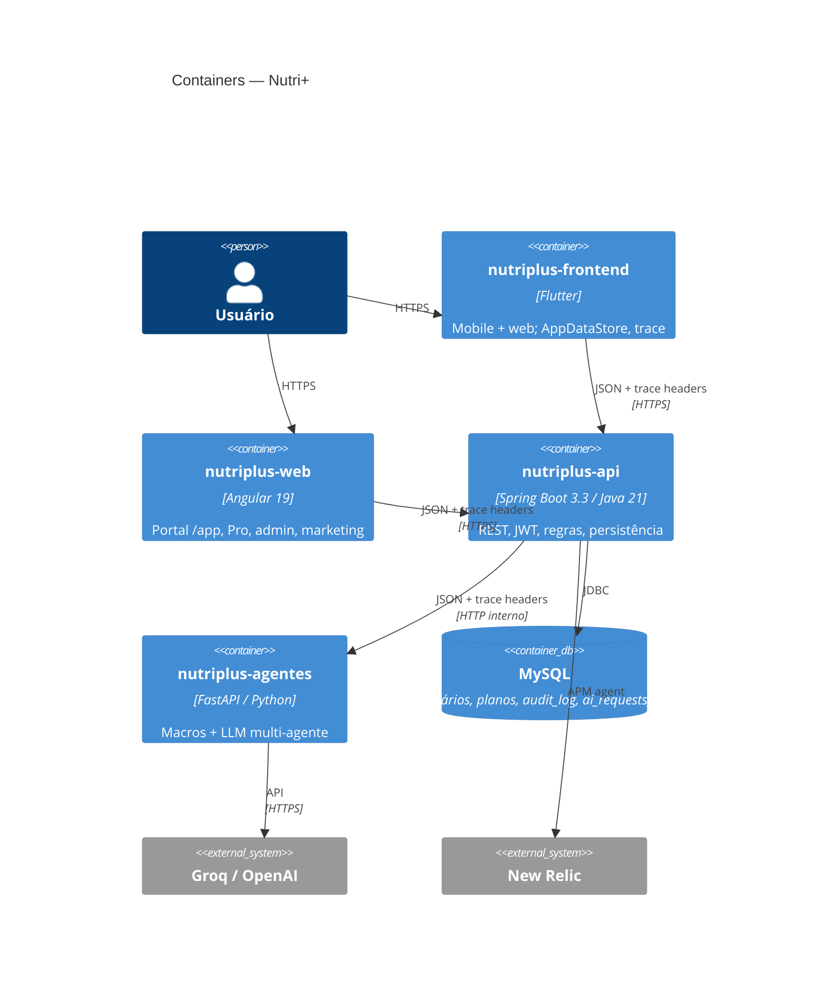
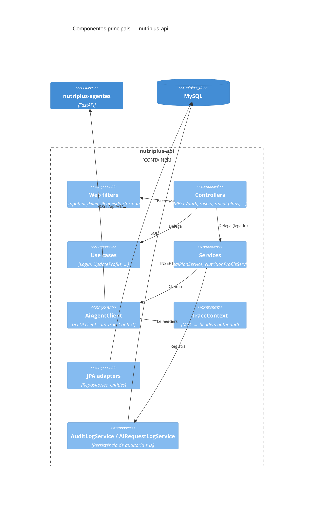
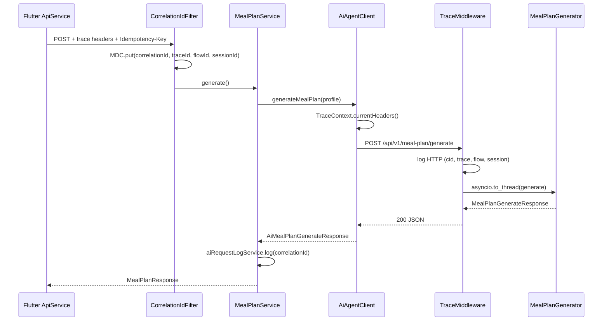
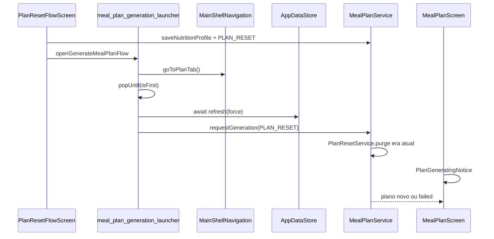
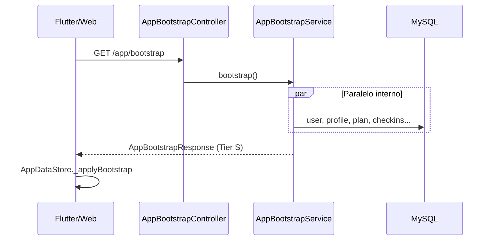

# Nutri+ — Modelo C4

Documentação de arquitetura no padrão [C4 Model](https://c4model.com/): **visão de produto** (o que o sistema entrega) e **visão técnica** (como os serviços se organizam).

> **Manutenção:** ao alterar fluxos, trace, segurança ou integrações entre repositórios, atualize este arquivo, [`RULES_MAP.md`](./RULES_MAP.md) e [`OBSERVABILITY.md`](./OBSERVABILITY.md).

---

## Visão de produto

### O que é o Nutri+

Plataforma de apoio nutricional que ajuda o usuário a:

1. Criar conta e manter perfil (incluindo foto).
2. Onboarding em wizard (13 passos): assistente (**Luna** ou **Bruno**), gostos, métricas, saúde, rotina.
3. Receber metas de macros calculadas de forma determinística.
4. Gerar plano alimentar semanal e lista de compras com apoio de IA multi-agente.
5. Fazer check-ins diários, acompanhar evolução e aderência ao plano.
6. (Opcional) Modo atleta com treinos e calorias extras — assinatura B2C.
7. (Opcional) Contratar nutricionista via marketplace Nutri+ Pro.
8. **Zerar plano** e regerar do zero (`PLAN_RESET`) sem esperar ciclo de 15 dias.
9. **Congelar conta** (portal web) e reativar depois; purge automático após 90 dias.
10. **Bootstrap agregado** pós-login (`GET /app/bootstrap`) para dashboard rápido.

O produto **não substitui** um nutricionista; as recomendações de IA vêm com disclaimer explícito.

### Personas e sistemas externos

| Ator / sistema | Papel |
|----------------|-------|
| **Usuário final** | Usa o app Flutter (mobile/web) ou portal Angular. |
| **Nutricionista (CRN)** | Portal Pro: pacientes, dossiê, chat, convites. |
| **Admin** | Flags, planos, aprovação de acessos. |
| **Equipe de suporte / engenharia** | Investiga incidentes usando IDs de correlação nos logs. |
| **MySQL** | Persistência de usuários, perfis, planos, auditoria e log de chamadas IA. |
| **Groq / OpenAI** | LLM usado pelo agente (Luna/Bruno) para montar planos quando `USE_MOCK_LLM=false`. |
| **Mercado Pago** | Assinatura modo atleta (B2C). |
| **Stripe** | Pagamento de consultas Nutri+ Pro. |
| **New Relic** | APM da API (custom attributes via `NewRelicTraceBridge`). |
| **Railway / Vercel** | Hospedagem da API, agente, frontend e portal web. |

### Jornadas de negócio (Flow IDs)

O app etiqueta cada ação com `X-Flow-Id` para linguagem de produto nos logs:

| Flow ID | Jornada |
|---------|---------|
| `register` | Cadastro |
| `login` | Login |
| `refresh-token` | Renovação de sessão |
| `onboarding-metrics` | Salvar perfil nutricional (wizard) |
| `onboarding-agent` | Escolha Luna/Bruno (wizard) |
| `onboarding-preferences` | Gostos alimentares (wizard) |
| `generate-meal-plan` | Gerar plano alimentar |
| `update-profile` | Atualizar nome/foto |
| `change-password` | Troca de senha |
| `checkin` | Check-in de refeição |
| `progress-measurement` | Registrar medidas corporais |
| `progress-review` | Reavaliação IA de evolução |
| `subscription-checkout` | Assinar plano atleta |
| `subscription-cancel` | Cancelar renovação |
| `care-invite` | Aceitar convite nutricionista |
| `marketplace-search` | Buscar nutricionista |
| `training-profile` | Salvar perfil atleta / treinos |
| `app-bootstrap` | Login → dashboard (request agregado Tier S) |
| `plan-reset` | Zerar plano atual e gerar outro |
| `regeneration-eligibility` | Checagem de travas de regeração |
| `account-freeze` | Congelar conta (portal web) |
| `account-reactivate` | Reativar conta congelada |
| `plan-generation-retry` | Retry após falha de geração |

Com isso, suporte consegue filtrar logs por **ação de produto**, não só por URL.

### Valor da observabilidade para o produto

| Necessidade | Como o trace atende |
|-------------|---------------------|
| “Deu erro ao gerar plano” | `correlationId` no erro do app + mesmo ID nos logs da API e do agente |
| “Usuário travou no onboarding” | `sessionId` + `flowId=onboarding` em toda a sessão do app |
| Conformidade / auditoria | `audit_log` e `ai_requests_log` com `correlationId` |
| SLA de IA | Métricas `nutriplus.ai.agent.*` e duração de geração de plano |

---

## Nível 1 — Diagrama de contexto (System Context)



**Visão técnica resumida:** usuários finais interagem com Flutter ou portal Angular. A API é o ponto de entrada autenticado; o agente é serviço interno; MySQL é fonte transacional única.

---

## Nível 2 — Diagrama de containers (Container)



### Responsabilidades por container

| Container | Repositório | Responsabilidade principal |
|-----------|-------------|----------------------------|
| App Flutter | `nutriplus-frontend` | UX mobile/web, `AppDataStore`, trace, loading UX |
| Portal web | `nutriplus-web` | Desktop portal, Pro, admin, freeze/delete conta |
| API | `nutriplus-api` | Auth, regras de negócio, persistência, propagação de trace |
| Agente | `nutriplus-agentes` | Cálculo de macros e geração de plano (mock ou LLM) |
| MySQL | — | Fonte única de verdade transacional |

### Propagação de trace (container → container)

```
Flutter / Web  ──[X-Correlation-Id, X-Trace-Id, X-Flow-Id, X-Session-Id]──►  API  ──[mesmos headers]──►  Agente
```

Detalhes em [`OBSERVABILITY.md`](./OBSERVABILITY.md).

---

## Nível 3 — Componentes (API)



### Componentes de trace na API

| Componente | Arquivo | Função |
|------------|---------|--------|
| `CorrelationIdFilter` | `infrastructure/web/CorrelationIdFilter.java` | Entrada HTTP: resolve/gera IDs, MDC, ecoa na resposta |
| `IdempotencyFilter` | `infrastructure/web/IdempotencyFilter.java` | Dedup mutações via `Idempotency-Key` + `idempotency_keys` |
| `RequestPerformanceFilter` | `infrastructure/web/RequestPerformanceFilter.java` | Duração; warn em requests lentos |
| `MdcUserFilter` | `infrastructure/web/MdcUserFilter.java` | `userId` no MDC (rotas autenticadas) |
| `TraceContext` | `infrastructure/web/TraceContext.java` | Exporta MDC (incl. idempotency) para chamadas HTTP saída |
| `AiAgentClient` | `client/AiAgentClient.java` | Propaga headers ao agente |
| `ApiExceptionHandler` | `infrastructure/web/ApiExceptionHandler.java` | `correlationId` / `traceId` no JSON de erro |
| `NewRelicTraceBridge` | `infrastructure/observability/NewRelicTraceBridge.java` | Custom attributes NR; modo defensivo se agent ausente |
| `AppBootstrapService` | `service/AppBootstrapService.java` | Agrega dados do dashboard (Tier S) |
| `PlanRegenerationPolicyService` | `service/PlanRegenerationPolicyService.java` | Travas e reasons de regeração |
| `PlanResetService` | `service/PlanResetService.java` | Purge tracking era atual (PLAN_RESET) |
| `FreezeAccountUseCase` | `application/user/FreezeAccountUseCase.java` | Congelamento de conta |
| `AccountPurgeScheduler` | `service/AccountPurgeScheduler.java` | Purge contas congeladas 90+ dias |

---

## Nível 3 — Componentes (Agente)

| Componente | Arquivo | Função |
|------------|---------|--------|
| `TraceMiddleware` | `app/trace_middleware.py` | Log HTTP com cid/trace/flow/session; métricas Prometheus |
| `MealPlanGenerator` | `app/meal_plan_generator.py` | LLM ou mock (logs internos — ver limitações em OBSERVABILITY) |
| `nutrition_engine` | `app/nutrition_engine.py` | Macros determinísticos |
| `main` | `app/main.py` | Rotas FastAPI, lifespan, `/health`, `/metrics` |

---

## Nível 3 — Componentes (Frontend Flutter)

| Componente | Arquivo | Função |
|------------|---------|--------|
| `TraceService` | `lib/services/trace_service.dart` | `sessionId` persistente; gera cid/trace por request |
| `ApiService` | `lib/services/api_service.dart` | Injeta headers; `flowId` por endpoint |
| `AuthProvider` | `lib/providers/auth_provider.dart` | `initTrace()` no boot |
| `AppDataStore` | `lib/providers/app_data_store.dart` | Bootstrap cache; `mealPlanRevision` |
| `PlanGenerationController` | `lib/providers/plan_generation_controller.dart` | Fases idle/generating/ready/failed |
| `meal_plan_generation_launcher` | `lib/.../meal_plan_generation_launcher.dart` | Nav Tier C + refresh + generation |
| `NutriBusyButton` | `lib/src/core/nutri_busy_button.dart` | Botão async Tier B/C |

Documentação detalhada: [`nutriplus-frontend/docs/ARCHITECTURE.md`](../../nutriplus-frontend/docs/ARCHITECTURE.md).

---

## Nível 3 — Componentes (Portal Web)

| Componente | Caminho | Função |
|------------|---------|--------|
| `MealPlanGenerationFacade` | `application/portal/meal-plan/` | Orquestra geração no portal |
| `PlanResetEntryComponent` | `presentation/portal/plan-reset/` | UI zerar plano |
| `AuthFacade` | `application/auth/` | Sessão, refresh, trace |
| Bootstrap portal | `GET /app/bootstrap` consumer | Dashboard agregado |

Documentação: [`nutriplus-web/docs/ARCHITECTURE.md`](../../nutriplus-web/docs/ARCHITECTURE.md).

---

## Nível 4 — Código (caminho crítico: gerar plano)

Sequência simplificada para `POST /meal-plans/generate`:



### PLAN_RESET end-to-end



### GET /app/bootstrap (login warm)



### Account freeze → purge

Ver sequência completa em [`ACCOUNT_LIFECYCLE.md`](./ACCOUNT_LIFECYCLE.md).

---

## Mapa de dados críticos

| Entidade / conceito | Onde vive | Notas client-side |
|---------------------|-----------|-------------------|
| `User` | MySQL `users` | `account_frozen_at`, `loginEnabled` |
| `MealPlan` (latest) | MySQL + cache client | `mealPlanRevision` no Flutter |
| Check-in era | Por `meal_id` do plano atual | Purge em PLAN_RESET |
| `plan_regen_locked_until` | User/profile | Lock 15 dias pós-geração |
| Bootstrap payload | `AppBootstrapResponse` | 1 request pós-login |

---

## Matriz de deploy

| Container | Runtime | CI/CD |
|-----------|---------|-------|
| nutriplus-api | Railway | GitHub Actions → Docker |
| nutriplus-agentes | Railway | GitHub Actions → Docker |
| nutriplus-web | Vercel | Git push main |
| nutriplus-frontend (web) | Vercel | Git push main |
| nutriplus-frontend (mobile) | App Store / Play | Tags + manual |

Detalhes: [`DEPLOYMENT.md`](./DEPLOYMENT.md).

---

## Estados de maturidade (honestidade de produto)

| Capacidade | Status | Notas |
|------------|--------|-------|
| Trace por request HTTP (FE → API → agente) | Implementado | Headers + MDC + middleware |
| Idempotency-Key (mutações) | Implementado | API filter + DB; local desligado |
| Flow ID por ação de produto | Implementado | Todos os métodos do `ApiService` |
| Erro com `correlationId` para o usuário | Implementado | JSON de erro da API |
| Logs JSON em prod/homolog (API) | Implementado | `logback-spring.xml` + LogstashEncoder |
| Custom attributes NR na API | Implementado | `NewRelicTraceBridge` defensivo + fat jar |
| PLAN_RESET (zerar plano) | Implementado | API + Flutter + Web |
| Account freeze / reactivate / purge 90d | Implementado | Portal web + V62 |
| Bootstrap agregado `/app/bootstrap` | Implementado | Tier S; Flutter `AppDataStore` |
| Loading UX Tier A/B/C (Flutter) | Implementado | `NutriBusyButton`, optimistic check-ins |
| Trace em logs internos do LLM (agente) | Parcial | Worker thread sem contexto |
| Personas Luna/Bruno + Groq | Implementado | `config/agents.yaml` + prompts |
| Onboarding wizard (persona + gostos + métricas) | Implementado | Flutter 3 telas |
| Usuário de teste local | Implementado | `teste@nutriplus.local` / `Nutri123!` |
| Trace estável em retry 401 (app) | Implementado | Headers reutilizados no `_authorized` |
| `ai_requests_log` com trace/flow/session | Parcial | Só `correlationId` hoje |
| OpenTelemetry / W3C `traceparent` | Não implementado | Roadmap |

Roadmap técnico detalhado: [`OBSERVABILITY.md`](./OBSERVABILITY.md#roadmap).

---

## Documentos relacionados

| Documento | Escopo |
|-----------|--------|
| [`RULES_MAP.md`](./RULES_MAP.md) | Mapa mestre de regras (IDs RULE-*) |
| [`ACCOUNT_LIFECYCLE.md`](./ACCOUNT_LIFECYCLE.md) | Freeze, reactivate, purge |
| [`CLIENT_LOADING_UX.md`](./CLIENT_LOADING_UX.md) | Tiers A/B/C, NutriBusyButton |
| [`LATENCY_GUARDRAILS.md`](./LATENCY_GUARDRAILS.md) | Guardrails consolidados |
| [`PLAN_REGENERATION.md`](./PLAN_REGENERATION.md) | Política de regeração e PLAN_RESET |
| [`ARCHITECTURE.md`](./ARCHITECTURE.md) | Clean Architecture, packages, bounded contexts |
| [`OBSERVABILITY.md`](./OBSERVABILITY.md) | Trace, logs, métricas, auditoria |
| [`SECURITY.md`](./SECURITY.md) | JWT, rate limit, lockout |
| [`DEPLOYMENT.md`](./DEPLOYMENT.md) | Railway, variáveis de ambiente |
| [`nutriplus-agentes/docs/architecture.md`](../../nutriplus-agentes/docs/architecture.md) | Visão do agente |
| [`nutriplus-frontend/docs/ARCHITECTURE.md`](../../nutriplus-frontend/docs/ARCHITECTURE.md) | Visão do app |
| [`nutriplus-web/docs/ARCHITECTURE.md`](../../nutriplus-web/docs/ARCHITECTURE.md) | Visão do portal |
