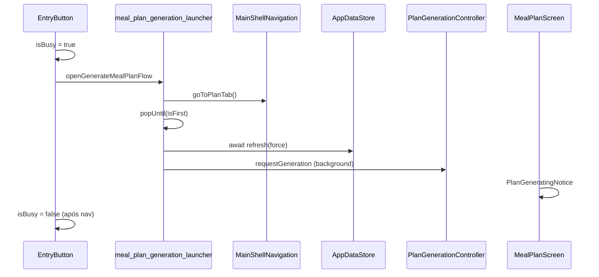

# Loading e async UX — clientes Nutri+

Padrões cross-client para feedback visual em ações assíncronas, alinhados aos SLAs da API ([PERFORMANCE.md](./PERFORMANCE.md)) e guardrails ([LATENCY_GUARDRAILS.md](./LATENCY_GUARDRAILS.md)).

> **Regras:** [RULES_MAP.md](./RULES_MAP.md) (seção Cliente — loading)

---

## Tiers de interação

| Tier | Latência típica | Exemplos | Padrão UI |
|------|-----------------|----------|-----------|
| **A** | < 500 ms | check-in, toggle | Optimistic UI; spinner só se >300 ms |
| **B** | 0,5–2 s | salvar perfil, checar elegibilidade | Botão `isBusy` + disable |
| **C** | até ~30 s | gerar/zerar plano | `PlanGenerationController` + `PlanGeneratingNotice` persistente; **sem** overlay global |

---

## Flutter — componentes

| Componente | Arquivo | Função |
|------------|---------|--------|
| `NutriBusyButton` | `lib/src/core/nutri_busy_button.dart` | Filled/outlined com spinner 22px |
| `NutriAsyncBody` | `lib/src/core/nutri_ui_widgets.dart` | Skeleton + pull-to-refresh |
| `AppDataStore` | `lib/providers/app_data_store.dart` | Cache bootstrap; `mealPlanRevision` |
| `PlanGenerationController` | `lib/providers/plan_generation_controller.dart` | Fases: idle → generating → ready/failed |
| `PlanGeneratingNotice` | `lib/src/widgets/plan_generating_notice.dart` | Banner de progresso Tier C |
| `meal_plan_generation_launcher` | `lib/.../meal_plan_generation_launcher.dart` | Ordem nav + refresh + generation |

### Tier C — ordem correta (gerar / zerar plano)

**Regra:** usuário vê a aba Plano com notice **antes** do job terminar.

### Fix tela em branco pós-reset

**Causa raiz (3 bugs encadeados):**

1. `MealPlanScreen`: `_isEmpty=false` + `_plan=null` → `SizedBox.shrink()`.
2. `popUntil(isFirst)` destruía `PlanResetFlowScreen` antes do callback de sucesso.
3. Sync local não limpava `_plan` quando store ficava `null` após reset.

**Correções:**

- Fallback explícito quando `_plan == null` (empty state / `PlanGenerationCard`).
- `_isEmpty = (_plan == null)` em sync com `mealPlanRevision`.
- Launcher: navegar + `await refresh` **antes** de `requestGeneration`.
- Reload em transição `generating → failed`.

### Optimistic check-ins (Tier A)

`TodayScreen._toggleCheckin`: atualiza `_optimisticCheckins` no mesmo frame; reverte + snackbar em erro de API.

### Prefetch elegibilidade

`prefetchPlanRegenerationEligibility()` em `plan_regeneration_gate.dart`:

- Cache em `AppDataStore.planRegenerationEligibility`.
- Dialog leve se fetch > 300 ms (`interactiveSlowLoad: true`).

Chamado no mount de `MealPlanScreen` e `ProfileNutritionHubScreen`.

---

## Web — portal Angular

| Padrão | Onde |
|--------|------|
| `GET /app/bootstrap` ou `Promise.all` | Login → dashboard |
| `plan-reset-entry.component` | Zerar plano no portal |
| Busy em ações de assinatura | Paridade com Flutter (quando aplicável) |
| Feature flags em `sessionStorage` | Não bloquear login com initializer síncrono |

Doc local: [nutriplus-web/docs/ARCHITECTURE.md](../../nutriplus-web/docs/ARCHITECTURE.md)

---

## Entry points Tier C (Flutter)

| Ação | Tela / componente | Busy |
|------|-------------------|------|
| Gerar plano (empty) | `PlanGenerationCard` | `NutriBusyButton` |
| Zerar plano | `PlanResetFlowScreen`, hub tile, `MealPlanScreen` | `NutriBusyButton` + tile spinner |
| Correção única | `PlanCorrectionFlowScreen` | `NutriBusyButton` |
| Reavaliação → novo plano | `ProgressReviewScreen` | `NutriBusyButton` |
| Pós-save perfil | `ProfileEditEligibility` dialog | `NutriBusyButton` |

---

## Hub perfil — tile loading

`ProfileSettingsTile.loading`: spinner no trailing do tile tocado (correção / zerar), não spinner global no fim da lista.

---

## Critérios de aceite (QA)

- Zerar plano → nunca corpo branco na aba Plano.
- Botão Tier B/C mostra busy em ≤200 ms após tap.
- Check-in responde visualmente no mesmo frame.
- Falha de geração → mensagem + retry, não tela vazia.

---

## Documentos relacionados

- [nutriplus-frontend/docs/ARCHITECTURE.md](../../nutriplus-frontend/docs/ARCHITECTURE.md) — detalhe Flutter
- [PLAN_REGENERATION.md](./PLAN_REGENERATION.md) — regras PLAN_RESET
- [RELEASE_NOTES_2026-07.md](./RELEASE_NOTES_2026-07.md) — changelog jul/2026
