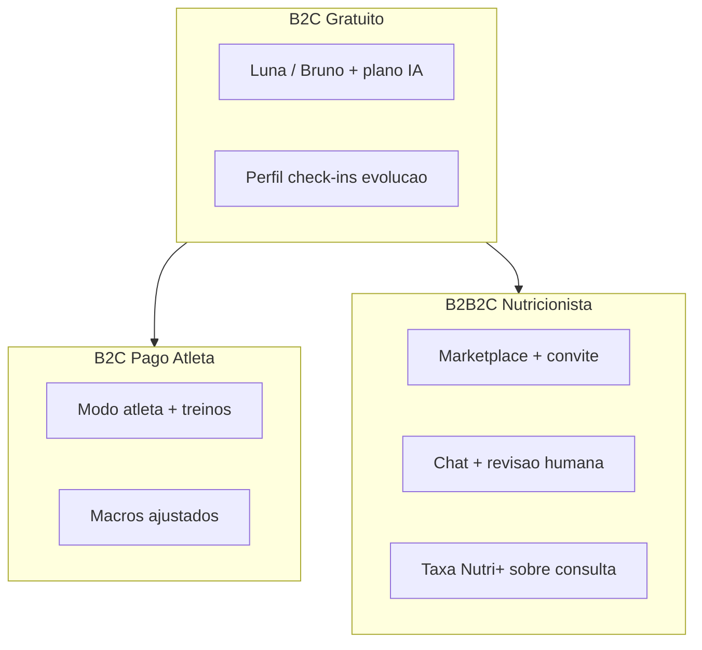

# Nutri+ — Resumo executivo

Documento autossuficiente para investidores, parceiros e liderança. Detalhes técnicos e de produto: [PRODUCT.md](./PRODUCT.md), [FEATURES.md](./FEATURES.md), [BUSINESS_MODEL.md](./BUSINESS_MODEL.md).

---

## Visão em uma frase

O Nutri+ é um app **B2C gratuito com IA** que organiza alimentação do dia a dia, com **upgrade pago** para modo atleta e **upgrade humano opcional** via marketplace de nutricionistas — onde a plataforma monetiza uma **taxa sobre o profissional**, não sobre o paciente de forma oculta.

---

## Problema e solução

| Problema | Solução Nutri+ |
|----------|----------------|
| Consulta com nutricionista é cara e inacessível para muitos | Plano alimentar personalizado com IA (Luna/Bruno), grátis |
| Apps de dieta genéricos não consideram saúde, rotina e preferências | Onboarding de 13 passos + revisão clínica automatizada (Evandro, Helena, Flora) |
| Atletas precisam alinhar dieta ao gasto calórico do treino | Modo atleta com MET, calorias extras e plano recalculado |
| Nutricionistas perdem tempo coletando anamnese | Paciente chega com perfil, medidas, check-ins e plano IA no dossiê |
| Falta continuidade entre consultas | Chat + acompanhamento pós-consulta (30 dias default) |

---

## Três camadas de valor

| Camada | Quem paga | Receita Nutri+ |
|--------|-----------|----------------|
| **Gratuito (IA)** | Ninguém | Aquisição e retenção |
| **Atleta** | Paciente (assinatura) | Recorrente B2C |
| **Nutricionista** | Taxa sobre consulta | Variável B2B2C (~15% default) |

Referência de preços: [PRICING.md](./PRICING.md).

---

## Estado do produto (implementado)

### App mobile/web (Flutter)

- Cadastro, login, recuperação de senha
- Onboarding wizard (13 passos) + modo atleta opcional
- Shell principal: Hoje, Plano, Evolução, Compras, Perfil
- Geração assíncrona de plano alimentar + lista de compras (IA multi-agente)
- Check-ins diários, streak, aderência ao plano
- Medidas corporais a cada 15 dias + reavaliação IA
- Edição de perfil nutricional + regeneração manual de plano
- Assinatura atleta (Mercado Pago) — paywall via feature flag
- Marketplace de nutricionistas, chat, convites
- FAQ, lembretes locais, feedback in-app

### Portal web (Angular)

- Marketing, autenticação, onboarding espelhado
- Portal logado `/app/*` (desktop): plano, evolução, compras, treinos, assinatura
- Portal Pro para nutricionistas: pacientes, dossiê, chat, convites, relatórios
- Admin: planos, flags, nutricionistas, acessos

### Backend (Spring Boot)

- 26 controllers REST, JWT, rate limit, idempotência
- Integração Mercado Pago (assinatura atleta) e Stripe (consultas Pro)
- Agente IA (FastAPI/Python) com Groq/OpenAI
- Observabilidade: trace distribuído, audit log, métricas Prometheus/New Relic

### Em beta / feature-flag

- Cobrança atleta (`SUBSCRIPTION_BILLING`) — pode ficar desligada durante beta
- E-mail transacional completo — roadmap ([BILLING_AND_AUTH_ROADMAP.md](./BILLING_AND_AUTH_ROADMAP.md))

---

## Diferenciais

1. **IA multi-agente com revisão:** Luna/Bruno geram; Evandro (clínico), Helena (idosos), Flora (dietas), Mercado (lista de compras) e Garcia (progresso) revisam.
2. **Acessibilidade:** faixa de consulta R$ 49–149; app grátis; linguagem inclusiva para idosos.
3. **Dados pré-consulta:** nutricionista recebe dossiê completo — perfil, medidas, aderência, plano IA.
4. **IA primeiro, humano depois:** nutricionista é upgrade explícito, não bloqueio.
5. **Observabilidade de produto:** cada ação do usuário tem `flowId` nos logs para suporte e funil.

---

## Modelo de receita

| Fonte | Mecanismo | Status |
|-------|-----------|--------|
| Assinatura atleta | Mensal / anual via Mercado Pago | Implementado (flag) |
| Taxa marketplace | % sobre consulta Stripe Connect | Implementado |
| Gratuito | Aquisição | Ativo |

Valores sugeridos: atleta R$ 19,90–29,90/mês; consulta R$ 49–149. Ver [PRICING.md](./PRICING.md).

---

## Stack técnica (alto nível)

| Camada | Tecnologia | Hospedagem |
|--------|------------|------------|
| App | Flutter (iOS, Android, Web) | Vercel (web), lojas (mobile) |
| Portal | Angular 19 | Vercel |
| API | Spring Boot 3.3 / Java 21 | Railway |
| Agente IA | FastAPI / Python | Railway |
| Banco | MySQL | Railway |
| LLM | Groq / OpenAI | Externo |
| Pagamentos | Mercado Pago + Stripe | Externo |

Diagrama completo: [C4.md](./C4.md). Integrações: [INTEGRATIONS.md](./INTEGRATIONS.md).

---

## Compliance

- Disclaimer de IA em todo plano gerado
- Termos de uso, privacidade (LGPD), consentimento de compartilhamento com nutricionista
- Exclusão de conta (`DELETE /users/me`)
- Checklist de release: [COMPLIANCE.md](./COMPLIANCE.md)
- Textos legais: [legal/](./legal/) e `src/main/resources/legal/`

---

## Roadmap resumido (3–6 meses)

| Prioridade | Item |
|------------|------|
| Alta | Ativar paywall atleta em produção (flag + MP prod) |
| Alta | E-mail transacional (verificação, reset senha, recibos) |
| Média | Paridade Flutter ↔ Web (reativar assinatura no app) |
| Média | OpenAPI / documentação de API admin |
| Média | Regeneração guiada de plano após editar perfil |
| Baixa | ERD e schema reference |

Roadmap detalhado de billing: [BILLING_AND_AUTH_ROADMAP.md](./BILLING_AND_AUTH_ROADMAP.md).

---

## Onde ir a partir daqui

| Público | Próximo documento |
|---------|-------------------|
| Produto / UX | [PRODUCT.md](./PRODUCT.md) → [FEATURES.md](./FEATURES.md) |
| Engenharia | [C4.md](./C4.md) → [INTEGRATIONS.md](./INTEGRATIONS.md) |
| Comercial | [BUSINESS_MODEL.md](./BUSINESS_MODEL.md) → [PRICING.md](./PRICING.md) |
| Nutricionistas | [NUTRI_PLUS_PRO.md](./NUTRI_PLUS_PRO.md) |
| Índice completo | [README.md](./README.md) |
