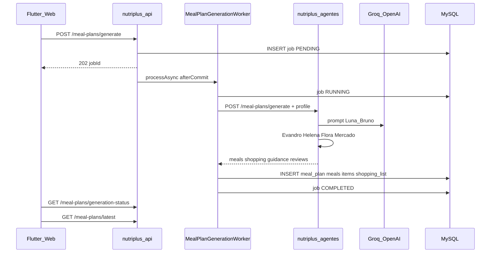

# Nutri+ — Integrações externas

Mapa consolidado de integrações da plataforma. Runbooks detalhados permanecem nos documentos específicos — este arquivo é o **índice e visão transversal**.

Arquitetura: [C4.md](./C4.md). Observabilidade: [OBSERVABILITY.md](./OBSERVABILITY.md).

---

## Mapa de integrações

| Integração | Propósito | Direção | Repo principal | Doc detalhado |
|------------|-----------|---------|----------------|---------------|
| **Groq / OpenAI** | LLM para planos, chat, revisões | API → agentes → LLM | `nutriplus-agentes` | [SECONDARY_AGENTS.md](../../nutriplus-agentes/docs/SECONDARY_AGENTS.md) |
| **Mercado Pago** | Assinatura atleta B2C | API ↔ MP | `nutriplus-api` | [MERCADOPAGO_SETUP.md](./MERCADOPAGO_SETUP.md) |
| **Stripe** | Pagamento consultas Nutri+ Pro | API ↔ Stripe | `nutriplus-api` | [NUTRI_PLUS_PRO.md](./NUTRI_PLUS_PRO.md) |
| **MySQL** | Persistência transacional | API ↔ DB | `nutriplus-api` | [DEPLOYMENT.md](./DEPLOYMENT.md) |
| **Firebase Crashlytics** | Crashes mobile | App → Firebase | `nutriplus-frontend` | [DEPLOYMENT.md](../../nutriplus-frontend/docs/DEPLOYMENT.md) |
| **New Relic** | APM | API + agentes → NR | ambos | [observability/NEW_RELIC.md](./observability/NEW_RELIC.md) |
| **Prometheus / Grafana** | Métricas ops + funil | scrape API | `nutriplus-api` | [observability/README.md](./observability/README.md) |
| **Product analytics** | Eventos de funil | clientes → API | API + frontend | [OBSERVABILITY.md](./OBSERVABILITY.md) |
| **Railway** | Hospedagem API + agente + MySQL | — | api, agentes | [DEPLOYMENT.md](./DEPLOYMENT.md) |
| **Vercel** | Hospedagem Flutter web + Angular | — | frontend, web | DEPLOYMENT de cada repo |

---

## Agente IA (nutriplus-agentes)

Serviço **interno** — não exposto diretamente ao app. A API orquestra via `AiAgentClient`.

| Endpoint agente | Chamado por | Função |
|-----------------|-------------|--------|
| `POST /api/v1/meal-plans/generate` | `MealPlanGenerationProcessor` | Plano + lista + guidance |
| `POST /api/v1/progress/review` | `ProgressController` | Reavaliação evolução |
| Chat endpoints | `ConversationController` | Respostas Luna/Bruno |

**Autenticação:** header interno + trace headers propagados da API.

**LLM:** Groq (default) ou OpenAI; mock via `USE_MOCK_LLM=true` em dev.

Doc: [`nutriplus-agentes/docs/architecture.md`](../../nutriplus-agentes/docs/architecture.md).

---

## Sequência: gerar plano alimentar



**Cache:** `getLatest()` usa cache por userId; invalidado em `NutriCacheEvictionService` após geração.

**Idempotência:** jobs ativos (PENDING/RUNNING) impedem duplicação; jobs stale (>15 min) são marcados FAILED.

---

## Mercado Pago (assinatura atleta)

| Aspecto | Detalhe |
|---------|---------|
| Escopo | B2C: ATHLETE_MONTHLY, ATHLETE_YEARLY |
| Checkout | Redirect ou mock mode |
| Webhook | `POST/GET /payments/mercadopago/webhook` |
| Renovação | Scheduler + charge com cartão salvo |
| Feature flag | `SUBSCRIPTION_BILLING` controla paywall |

Runbook: [MERCADOPAGO_SETUP.md](./MERCADOPAGO_SETUP.md). Estado de negócio: [SUBSCRIPTIONS.md](./SUBSCRIPTIONS.md).

---

## Stripe (Nutri+ Pro)

| Aspecto | Detalhe |
|---------|---------|
| Escopo | Pagamento de consulta paciente → nutricionista |
| Webhook | `POST /webhooks/stripe` |
| Split | Taxa plataforma (~15%) + repasse nutri |
| Connect | Stripe Connect para nutricionistas |

Regras: [NUTRI_PLUS_PRO.md](./NUTRI_PLUS_PRO.md). **Gap:** runbook Stripe Connect dedicado (fase 2).

---

## Trace distribuído

Headers propagados em toda cadeia:

```
X-Correlation-Id, X-Trace-Id, X-Flow-Id, X-Session-Id, Idempotency-Key
```

```
Flutter/Web  ──►  nutriplus-api  ──►  nutriplus-agentes
```

Flow IDs de produto: ver tabela em [C4.md](./C4.md) e [PRODUCT.md](./PRODUCT.md).

---

## Product analytics

| Item | Detalhe |
|------|---------|
| Endpoint | `POST /analytics/events` |
| Cliente Flutter | `ProductAnalyticsService` |
| Cliente Web | `analytics-cta.directive` |
| Storage | eventos persistidos para funil (dashboard Grafana business) |

---

## Variáveis de ambiente críticas

| Variável | Integração |
|----------|------------|
| `MERCADOPAGO_ACCESS_TOKEN` | Mercado Pago |
| `MERCADOPAGO_WEBHOOK_SECRET` | MP webhook |
| `STRIPE_SECRET_KEY` / webhook secret | Stripe |
| `GROQ_API_KEY` / `OPENAI_API_KEY` | LLM |
| `AI_AGENT_BASE_URL` | URL interna do agente |
| `NEW_RELIC_LICENSE_KEY` | APM |
| `CORS_ALLOWED_ORIGINS` | Frontend + web origins |

Lista completa: [DEPLOYMENT.md](./DEPLOYMENT.md).

---

## Manutenção

Ao adicionar integração externa:

1. Adicionar linha na tabela deste documento.
2. Criar runbook dedicado se houver setup não trivial.
3. Atualizar [C4.md](./C4.md) (diagrama de containers).
4. Adicionar métricas/alertas em [OBSERVABILITY.md](./OBSERVABILITY.md).
