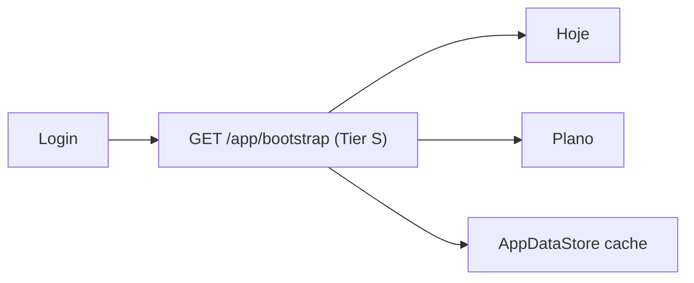

# Guardrails de latência — plataforma Nutri+

Consolidação **humana** das regras de performance e latência para API, clientes e agentes. Versão canônica para desenvolvedores **sem Cursor**.

> As regras em `.cursor/rules/*-latency-guardrails.mdc` referenciam este documento.

**Referências:** [PERFORMANCE.md](./PERFORMANCE.md) · [PERFORMANCE_BASELINE.md](./PERFORMANCE_BASELINE.md) · [RAILWAY_PERFORMANCE.md](./RAILWAY_PERFORMANCE.md) · [RULES_MAP.md](./RULES_MAP.md)

---

## Matriz consolidada

| Camada | Regra | Meta | Anti-padrão |
|--------|-------|------|-------------|
| **API** | Tier S p95 < 200 ms | bootstrap, checkins, readonly Pro | Endpoint S sem cache |
| **API** | Tier A p95 < 500 ms | auth, writes leves | Write síncrono pesado no request |
| **API** | Tier B p95 < 2 s | macros, swaps | N+1 em loop |
| **API** | Tier C p95 < 30 s | geração plano (async job) | Job síncrono bloqueando HTTP |
| **API** | Regressão vs baseline | ×1.2 max p95 warm | Deploy sem `./perf/run-baseline.sh` |
| **API** | Migrations | MySQL `BIGINT AUTO_INCREMENT` | `SERIAL`, `RETURNING` (PostgreSQL) |
| **Flutter** | First paint | ≤ 3 requests paralelos | Cascata 5+ GETs no mount |
| **Flutter** | Hub/dashboard | `Future.wait` | Awaits em série desnecessários |
| **Flutter** | Polling chat | mínimo **8 s** | < 3 s sem justificativa |
| **Flutter** | Cache | `AppDataStore`; não refetch total no pop | Refetch completo a cada navegação |
| **Flutter** | Validação | `flutter run --release` | Só emulador debug |
| **Web** | Abertura tela | `/app/bootstrap` ou `Promise.all` | Cascata sequencial 5+ GETs |
| **Web** | Polling chat Pro | mínimo **8 s** | Polling agressivo |
| **Web** | Feature flags | `sessionStorage` + defaults | `APP_INITIALIZER` síncrono na API |
| **Web** | Loading | conteúdo < 1 s com cache | Spinner bloqueando tela inteira |
| **Agentes** | Payload | só campos do prompt | Perfil duplicado inteiro |
| **Agentes** | Prompt | blocos opcionais condicionais | Texto fixo gigante |
| **Agentes** | Pós-processamento | O(n) refeições | Loops aninhados |
| **Agentes** | Schema | API + agentes sobem juntos | Campo novo quebra deserialize |

---

## API (nutriplus-api)

### SLAs por tier (p95)

| Tier | Alvo | Exemplos |
|------|------|----------|
| **S** | < 200 ms | `GET /app/bootstrap`, checkins, `/users/me`, Pro readonly |
| **A** | < 500 ms | auth, writes leves |
| **B** | < 2 s | macros síncronos, swaps |
| **C** | < 30 s | geração de plano (async) |

Local ~50 ms; prod warm dashboard < 800 ms soma. **Nunca confiar só em localhost.**

### Antes de merge / deploy

1. Endpoint Tier **S** novo → `@Cacheable`, HTTP cache público, ou justificar `none` no `PERFORMANCE.md`.
2. Migration com query por `user_id` + data → **índice composto** na mesma PR.
3. Listas com filhos → batch load (`MealLoader` pattern); **proibido N+1**.
4. Não desligar cache em prod nem encurtar TTL sem motivo documentado.
5. Writes que alteram leitura cacheada → `@CacheEvict` no serviço correto.
6. Regressão máxima vs baseline: **×1.2** no p95 warm.

### Proibido sem revisão explícita

- `findAll()` / full scan em tabelas que crescem (`security_events`, checkins, messages).
- Polling agressivo no backend; jobs síncronos pesados no request path.
- Remover índices ou reduzir heap/GC tuning do `docker-entrypoint.sh`.

```bash
./perf/run-baseline.sh local   # antes do PR
# prod (read-only): ./perf/run-baseline.sh prod
```

---

## Flutter (nutriplus-frontend)

1. **Hub / dashboard** — `Future.wait` para calls independentes.
2. **Polling** (chat) — **8 s** mínimo; cancelar timer no `dispose`.
3. **Imagens e listas** — `ListView.builder`; não montar marketplace inteiro por item.
4. **Cache local** — reutilizar `AppDataStore`/providers; não refetch total a cada `Navigator.pop`.
5. **Release** — `flutter run --release` para validar.

**Pergunta obrigatória em PR:** *essa mudança adiciona chamadas ou polling que o usuário paga em 3G?*

Detalhe UX: [CLIENT_LOADING_UX.md](./CLIENT_LOADING_UX.md)

---

## Web (nutriplus-web)

1. **Abertura de tela** — preferir 1 request agregado (`/app/bootstrap`) ou `Promise.all`.
2. **Polling** — mínimo **8 s** (chat Pro/paciente).
3. **Feature flags** — cache `sessionStorage`/defaults; **não** bloquear login com initializer síncrono.
4. **Listas** — paginação ou limite.
5. **Marketplace / Pro** — cache na sessão; invalidar só após mutação.

**Meta:** ≤ 3 requests no first paint por tela nova.

---

## Agentes (nutriplus-agentes)

Geração de plano é **Tier C** (async, até ~30 s). Mesmo assim:

1. **Payload** — só campos usados no prompt.
2. **Prompt** — blocos opcionais só quando presentes.
3. **Pós-processamento** — scrub/rebalance em O(n).
4. **Testes** — `pytest` nos paths alterados; mock LLM em CI.

A API aguarda o agente no generate: **+1 s no agente = +1 s percebido** pelo usuário.

---

## Fluxo crítico: login → dashboard



Evitar: login → 6 GETs sequenciais (perfil, plano, checkins, stats, schedule, eligibility).

---

## IDs de regra (referência rápida)

| ID | Resumo |
|----|--------|
| RULE-PERF-S1 | Tier S < 200 ms |
| RULE-PERF-002 | Sem N+1 |
| RULE-UX-002 | ≤ 3 requests first paint |
| RULE-UX-003 | Polling 8 s mínimo |
| RULE-UX-004 | Bootstrap agregado |
| RULE-AG-001 | Payload enxuto agente |

Lista completa: [RULES_MAP.md](./RULES_MAP.md)
