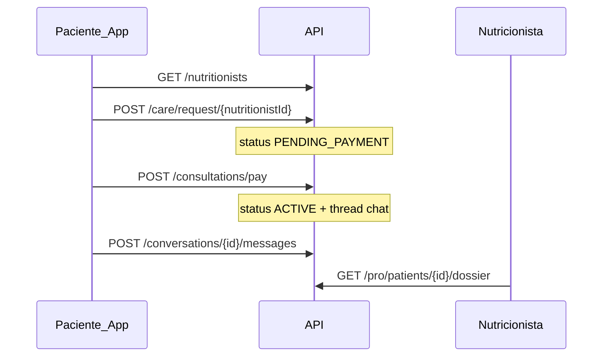

# Nutri+ Pro — Regras de negócio e produto

Documentação do marketplace **paciente ↔ nutricionista**: fluxos, status, permissões e integrações.

Repositórios:

| Repo | Papel |
|------|-------|
| `nutriplus-api` | Regras, persistência, pagamento, chat |
| `nutriplus-pro-web` | Portal do nutricionista |
| `nutriplus-frontend` | App do paciente (CTAs opcionais) |
| `nutriplus-agentes` | IA inalterada; plano continua gerado por Luna/Bruno |

---

## 1. Princípio: IA primeiro, nutricionista opcional

1. Paciente usa app **grátis** com IA (dúvidas, plano, check-ins, evolução).
2. A qualquer momento pode **contratar nutricionista** (marketplace ou convite).
3. Nutricionista **nunca bloqueia** o uso da IA.
4. Planos podem ser `AI_ONLY` ou revisados/publicados por humano (`NUTRITIONIST_APPROVED`).

---

## 2. Papéis (roles)

| Role | Descrição |
|------|-----------|
| `PATIENT` | Usuário do app Flutter (default no cadastro) |
| `NUTRITIONIST` | Profissional com CRN; acessa `/pro/*` |
| `ADMIN` | Moderação marketplace (fase 2) |

JWT claim: `roles: ["PATIENT"]` ou `["NUTRITIONIST"]`.

---

## 3. Status do vínculo (`care_relationships`)

| Status | Significado | Nutricionista vê dossiê? | Chat? |
|--------|-------------|--------------------------|-------|
| `PRE_ENGAGED` | Paciente aceitou **convite**; usa app grátis | ✅ (com consentimento) | ❌ |
| `PENDING_PAYMENT` | Marketplace: paciente iniciou contratação | ❌ | ❌ |
| `ACTIVE` | Consulta paga; acompanhamento vigente | ✅ | ✅ |
| `EXPIRED` | Período (`care_duration_days`) encerrou | ❌ | ❌ |
| `CANCELLED` | Encerrado manualmente | ❌ | ❌ |

**Fonte do vínculo (`source`):** `INVITE` | `MARKETPLACE`

---

## 4. Jornadas

### 4.1 Paciente — marketplace

### 4.2 Paciente — convite (pré-consulta)

1. Nutricionista gera convite (`POST /pro/invites`) → link ` /invite/{code}`.
2. Paciente abre app → `POST /care/accept-invite/{code}` + **consentimento LGPD**.
3. Status `PRE_ENGAGED` — paciente continua usando IA; nutricionista vê dossiê.
4. Na consulta: paciente paga (`POST /consultations/pay`) → `ACTIVE`.

### 4.3 Nutricionista — portal Pro

1. Registro: `POST /auth/register/nutritionist` (CRN, bio, especialidades).
2. Stripe Connect: `POST /pro/stripe/connect`.
3. Preço na faixa: `PUT /pro/pricing` (validado contra `pricing_guidelines`).
4. Convites, caseload, dossiê, chat, relatório mensal.

---

## 5. Consentimento de dados (LGPD)

- Tabela: `patient_data_consents`
- Escopos default: `PROFILE,MEASUREMENTS,MEAL_PLANS,CHECKINS,PROGRESS`
- Obrigatório ao aceitar convite (`consentDataSharing: true`).
- Documento legal: `GET /legal/data-sharing-consent`
- Nutricionista **só acessa** paciente com vínculo `PRE_ENGAGED` ou `ACTIVE` + registro de consentimento.

---

## 6. Precificação da consulta

Ver [PRICING.md](./PRICING.md). Resumo:

- Nutricionista define preço entre **min** e **max** da plataforma.
- Paciente paga valor cheio; plataforma retém **platform_fee_percent** (default 15%).
- Acompanhamento incluso: **care_duration_days** (default 30).

---

## 7. Bioimpedância e metabolismo

| Modo | `calculationMethod` | Uso |
|------|---------------------|-----|
| Básico (padrão) | `ESTIMATE` | Peso + altura + idade (Mifflin-St Jeor) |
| Com bio (% gordura) | `BIOIMPEDANCE` | % gordura → massa magra → Katch-McArdle |
| TMB da balança | `MANUAL_BMR` | Usuário informa kcal/dia do laudo de bio |

- Onboarding e progresso **não exigem** bio para começar.
- **Evolução:** % gordura e medidas ficam em `body_measurement_sessions` (gráficos); ver [METABOLISM_AND_BODY_COMPOSITION.md](./METABOLISM_AND_BODY_COMPOSITION.md).
- Nutricionista registra medição via `POST /pro/patients/{id}/measurements` com `calculationMethod` quando aplicável.

---

## 8. Planos alimentares — origem

Campo `meal_plans.plan_source`:

| Valor | Significado | Badge no app |
|-------|-------------|--------------|
| `AI_ONLY` | Só IA | Disclaimer IA |
| `NUTRITIONIST_APPROVED` | Nutri revisou/publicou | “Plano revisado por nutricionista humano” |
| `NUTRITIONIST_AUTHORED` | Nutri criou do zero | Idem |

Publicação: `PUT /pro/patients/{patientId}/meal-plans/{id}/publish` + registro em `plan_revisions`.

---

## 9. Chat

- Thread 1:1 por `care_relationship` (`conversation_threads`).
- Chat **somente** com status `ACTIVE`.
- MVP: REST polling (5–10s); mensagens em `messages`.
- Endpoints: `GET /conversations`, `GET /conversations/{threadId}`, `POST /conversations/{threadId}/messages`.

---

## 10. Dossiê do paciente

`GET /pro/patients/{patientId}/dossier` agrega:

- Perfil nutricional (meta, macros, saúde)
- Medições (`body_measurement_sessions`)
- Evolução e tendências
- Último plano IA + check-ins (aderência 7 dias)
- Última revisão de progresso IA

---

## 11. Relatório financeiro (nutricionista)

`GET /pro/reports/revenue?year=&month=`

- Receita bruta, taxa plataforma, líquido
- Número de consultas, ticket médio
- Histórico 6 meses

Dashboard resumido: `GET /pro/dashboard`

---

## 12. Modalidade e localidade

### 12.1 Modos de atendimento (`service_modes`)

| Modo | Significado | Requisitos |
|------|-------------|------------|
| `ONLINE` | Atendimento remoto (chat, video) | Nenhum endereço |
| `IN_PERSON` | Consultório presencial | `city` + `state_code` obrigatórios |

Nutricionista pode oferecer um ou ambos. Pelo menos um modo é obrigatório.

### 12.2 Localidade pública

Exibido no marketplace (listagem e detalhe):

- Modos de atendimento (badges)
- Cidade e UF (se presencial)
- `locationLabel` derivado (ex.: "São Paulo, SP · Online e presencial")

**Não exposto publicamente:** WhatsApp, endereço completo do consultório (fase 2: só pós-contratação).

### 12.3 Filtros marketplace (`GET /nutritionists`)

| Query | Efeito |
|-------|--------|
| `mode=ONLINE` | Só nutricionistas que atendem online |
| `mode=IN_PERSON` | Só presencial |
| `state=SP` | Filtra por UF |
| `city=São Paulo` | Match parcial na cidade |

### 12.4 Preferência do paciente

Na contratação (`POST /care/request`), paciente informa `preferredCareMode`:

- `ONLINE` — mora longe / prefere remoto
- `IN_PERSON` — quer ir ao consultório
- `EITHER` — tanto faz

Persistido em `care_relationships.preferred_care_mode` — visível no dossiê do nutricionista.

### 12.5 Contato pós-contratação

`GET /care/relationships/{id}/contact` (vínculo `ACTIVE`):

- `whatsappPhone` — se nutricionista cadastrou
- Chat in-app continua canal principal

### 12.6 Videochamada

| Fase | Entrega |
|------|---------|
| MVP | Nutricionista envia link Meet/Zoom pelo chat |
| Fase 2 | Embed Daily.co / Whereby |

---

## 13. Endpoints (referência rápida)

### Público / paciente

| Método | Path |
|--------|------|
| GET | `/nutritionists`, `/nutritionists/{id}` |
| GET | `/pricing/guidelines` |
| POST | `/care/accept-invite/{code}` |
| POST | `/care/request/{nutritionistId}` |
| POST | `/consultations/pay` |
| GET | `/care/my` |
| GET | `/care/relationships/{id}/contact` |
| GET/POST | `/conversations/*` |

### Nutricionista (`/pro`)

| Método | Path |
|--------|------|
| GET | `/pro/dashboard`, `/pro/patients`, `/pro/patients/{id}/dossier` |
| POST | `/pro/invites`, `/pro/stripe/connect`, `/pro/patients/{id}/measurements` |
| PUT | `/pro/profile`, `/pro/pricing` |
| PUT | `/pro/patients/{id}/meal-plans/{id}/publish` |
| GET | `/pro/reports/revenue` |

### Webhook

| POST | `/webhooks/stripe` |

---

## 14. Entidades (banco)

Migrations: `V17__nutritionist_platform.sql`, `V18__nutritionist_location_service_modes.sql`

- `nutritionists`, `care_relationships`, `consultations`
- `nutritionist_invites`, `patient_data_consents`
- `conversation_threads`, `messages`, `plan_revisions`
- `pricing_guidelines`, `stripe_customers`

---

## 15. O que não é Nutri+ Pro

- **Não** substitui consultório presencial — complementa com dados e chat assíncrono.
- **Não** diagnostica — nutricionista e IA operam dentro de disclaimers legais.
- **Não** obriga bioimpedância nem consulta paga para usar o app.

---

## 16. Fase 2 (planejado)

- Assinatura mensal paciente ↔ nutricionista (Stripe Billing)
- Editor completo de plano no portal
- Avaliações no marketplace
- CRN verificado automaticamente (CFN)
- Notificações push / e-mail
