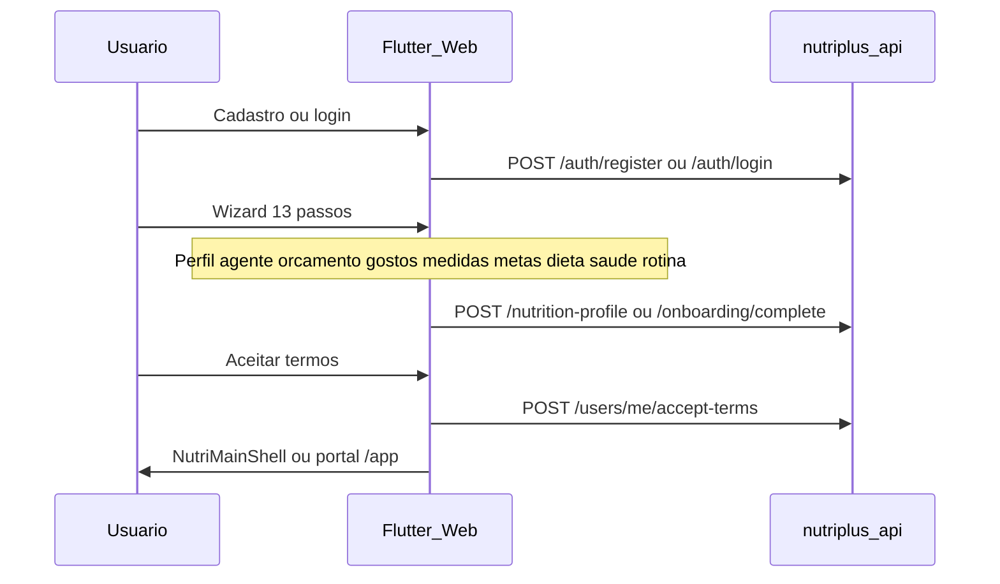
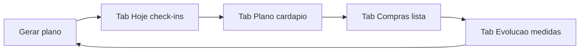
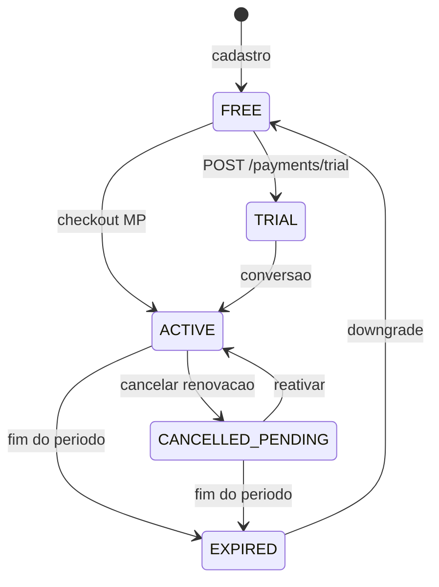

# Nutri+ — Guia de produto

Documento central para time interno: personas, jornadas e regras de negócio implementadas. Catálogo de features: [FEATURES.md](./FEATURES.md). Visão executiva: [EXECUTIVE_SUMMARY.md](./EXECUTIVE_SUMMARY.md).

---

## Personas

| Persona | Objetivo | Caminho principal |
|---------|----------|-------------------|
| **Usuário comum** | Organizar alimentação no dia a dia | Onboarding → plano IA → check-ins |
| **Atleta / praticante** | Alinhar dieta ao treino | Modo atleta + assinatura |
| **Idoso (60+)** | Perder peso com segurança | Helena revisa; aviso médico; mastigação |
| **Paciente com nutri** | Acompanhamento humano | Marketplace → consulta → chat |
| **Nutricionista (CRN)** | Captar pacientes pré-engajados | Portal Pro + marketplace |

---

## Jornada 1 — Cadastro e onboarding

### Passos do wizard (13)

Definidos em `OnboardingStepId` no Flutter:

1. Perfil básico (nascimento, sexo, cidade)
2. Assistente (Luna ou Bruno)
3. Tipo de uso (normal ou atleta)
4. Orçamento alimentar
5. O que gosta
6. O que evita
7. Como come (notas)
8. Medidas corporais
9. Metas (peso, objetivo)
10. Dieta e restrições
11. Condições de saúde
12. Alergias e medicamentos
13. Rotina (horários, refeições)

Após o wizard: termos legais → shell principal. Se atleta: setup de treinos antes ou depois dos termos.

**Subfluxo de edição de saúde** (4 passos): dieta → saúde → alergias → rotina — acessível pelo Perfil.

Detalhes de API: [ONBOARDING.md](./ONBOARDING.md).

---

## Jornada 2 — Plano alimentar e dia a dia

1. **Gerar plano:** fluxo guiado (medidas → confirmação → job assíncrono). Ver [INTEGRATIONS.md](./INTEGRATIONS.md).
2. **Hoje:** próxima refeição, marcar refeições feitas, streak, extras fora do plano.
3. **Plano:** cardápio por horário, notas de revisão médica (Evandro), flexibilidade semanal.
4. **Compras:** lista gerada com o plano; revisão de trocas sugeridas pela IA.
5. **Evolução:** aderência ao plano + medidas corporais + reavaliação a cada ~15 dias.

Engajamento: [ENGAGEMENT.md](./ENGAGEMENT.md). Progresso: [PROGRESS_ANALYSIS.md](./PROGRESS_ANALYSIS.md).

---

## Jornada 3 — Editar perfil e atualizar plano

### Regras implementadas

| Ação | Comportamento |
|------|---------------|
| Editar perfil nutricional | Salva via `POST /nutrition-profile`; **não** regenera plano automaticamente |
| Mudança de dieta ou idade | App exibe snackbar: "Gere um novo plano para aplicar" |
| Metas desatualizadas vs plano | Banner na aba Plano se diferença de calorias > 50 kcal |
| Gerar novo plano | Cria **novo** registro; `/meal-plans/latest` retorna o mais recente |
| Plano anterior | Permanece no banco (histórico); não é exibido ao usuário |
| **Zerar plano** | `PLAN_RESET`: apaga tracking da era atual, gera novo, reinicia ciclo 15d — ver [PLAN_REGENERATION.md](./PLAN_REGENERATION.md) |

**Não existe** botão "cancelar plano alimentar" — o fluxo é **regenerar** ou **zerar** (reset destrutivo).

Implementação da detecção de sync: `plan_target_sync.dart` no frontend.

---

## Jornada 4 — Assinatura atleta

| Ação | Efeito |
|------|--------|
| Assinar | Ativa modo atleta; estende `planValidUntil` |
| Cancelar renovação | `autoRenew=false`; **mantém acesso até `validUntil`** |
| Reativar | Restaura renovação automática (se período ainda válido) |
| Upgrade mensal → anual | Cobrança proporcional dos dias restantes |
| Expirar | Volta para FREE; desativa modo atleta (exceto grace period) |

Detalhes: [SUBSCRIPTIONS.md](./SUBSCRIPTIONS.md).

---

## Jornada 6 — Ciclo de vida da conta

1. Usuário acessa configurações no **portal web**.
2. **Congelar:** confirma senha/e-mail → `POST /users/me/freeze` → login bloqueado, dados preservados.
3. **Reativar:** `POST /auth/reactivate-account` com credenciais → novos tokens.
4. Após **90 dias** congelada sem reativar → purge automático (`AccountPurgeScheduler`).

Alternativa: **hard delete** imediato via `DELETE /users/me` (portal web).

Doc: [ACCOUNT_LIFECYCLE.md](./ACCOUNT_LIFECYCLE.md) · Regras: [RULES_MAP.md](./RULES_MAP.md) (RULE-ACCT-*)

---

## Jornada 5 — Nutricionista (Nutri+ Pro)

1. Paciente busca nutricionista no marketplace (`GET /marketplace/nutritionists`)
2. Solicita vínculo ou aceita convite (`POST /care/request`, `POST /care/accept-invite/{code}`)
3. Paciente paga consulta (`POST /consultations/pay`) via Stripe
4. Período de care (default 30 dias): chat + revisão humana do plano
5. Nutricionista usa Portal Pro: dossiê, pacientes, convites, relatório financeiro

Regras completas: [NUTRI_PLUS_PRO.md](./NUTRI_PLUS_PRO.md).

---

## Assistentes IA

| Agente | Papel | Escolhível pelo usuário |
|--------|-------|-------------------------|
| **Luna** | Assistente principal (feminina) | Sim |
| **Bruno** | Assistente principal (masculino) | Sim |
| **Evandro** | Revisor clínico | Não |
| **Helena** | Revisão idosos | Não |
| **Flora** | Revisão dietas especiais | Não |
| **Mercado** | Lista de compras | Não |
| **Garcia** | Análise de progresso | Não |

Detalhes: `nutriplus-agentes/docs/SECONDARY_AGENTS.md`.

---

## Disclaimer e limites

- Todo plano IA inclui disclaimer legal
- App **não substitui** nutricionista ou médico
- Recomendações para idosos enfatizam mudanças graduais
- Copy FAQ: [HELP_CONTENT.md](./HELP_CONTENT.md)

---

## Documentos relacionados

| Tema | Documento |
|------|-----------|
| Features por módulo | [FEATURES.md](./FEATURES.md) |
| Modo atleta | [TRAINING_MODE.md](./TRAINING_MODE.md) |
| Assinaturas | [SUBSCRIPTIONS.md](./SUBSCRIPTIONS.md) |
| Negócio | [BUSINESS_MODEL.md](./BUSINESS_MODEL.md) |
| Arquitetura | [C4.md](./C4.md) |
