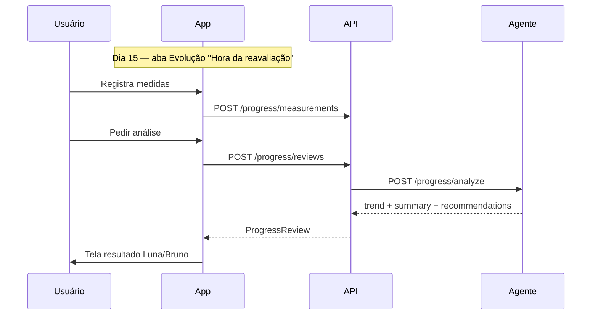
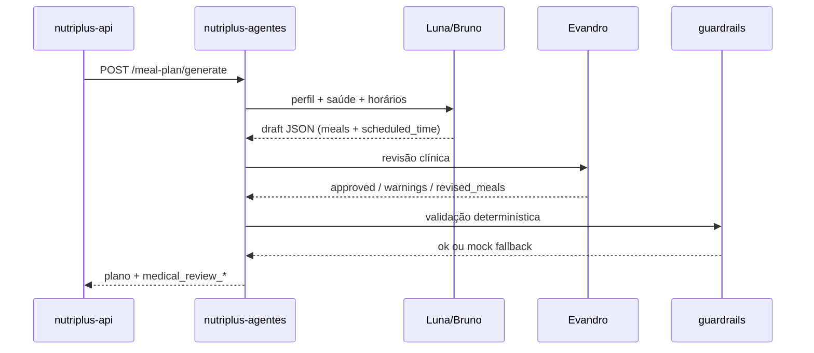

# Nutri+ — Reavaliação periódica com IA

Documento de produto e contrato técnico para análise de evolução corporal (gordura vs. músculo) com a Luna/Bruno.

---

## Objetivo

A cada intervalo configurável, o app convida o usuário a registrar **medidas atualizadas**. A IA compara com o registro anterior, cruza com **aderência ao plano** (check-ins) e devolve uma leitura acolhedora: perdeu gordura, ganhou músculo, recomposição, manutenção ou platô.

---

## Cadência (quando a IA analisa)

| Regra | Valor padrão | Observação |
|-------|--------------|------------|
| Intervalo entre reavaliações | **15 dias** | Campo `progress_review_interval_days` no perfil nutricional |
| Primeira reavaliação | 15 dias após o **baseline** (onboarding ou primeira medição) | Baseline = primeira `body_measurement_session` |
| Lembrete no app | Card na aba **Evolução** (link leve no **Hoje** quando `due`) | Não usa push na v1 |
| Antecipação | Usuário pode registrar medidas antes; análise só quando `due` | Evita ansiedade com pesagem diária |

Intervalos futuros permitidos (configurável): 7, 15, 21, 30 dias.

---

## Medidas coletadas

### Obrigatórias

| Campo | Unidade | Uso na análise |
|-------|---------|----------------|
| Peso | kg | Tendência de massa total |
| Data da medição | data | Comparar janelas de 15 dias |

### Bioimpedância (quando disponível)

| Campo | Unidade | Uso |
|-------|---------|-----|
| % gordura | % | Queda = perda de gordura provável |
| Massa muscular | kg | Subida com cintura estável = hipertrofia |

### Circunferências (fita métrica — recomendadas)

Medir sempre no **mesmo horário** (de manhã, em jejum, relaxado):

| Campo | Onde medir | Sinal típico |
|-------|------------|--------------|
| Cintura | Linha do umbigo | ↓ gordura abdominal |
| Quadril | Parte mais larga do glúteo | Contexto formato corporal |
| Peito / tórax | Linha dos mamilos | Massa superior |
| Pescoço | Base do pescoço | Gordura / retenção |
| Braço direito / esquerdo | Ponto médio, braço relaxado | ↑ músculo em bulk |
| Coxa direita / esquerda | 20 cm acima do joelho | ↑ pernas / recomp |

Campos opcionais: quanto mais preenchidos, melhor a confiança da IA. Mínimo útil além do peso: **cintura** + **um braço**.

### Contexto enviado à IA (automático)

- Meta (`LOSE_WEIGHT`, `GAIN_MASS`, `MAINTAIN_WEIGHT`)
- Aderência semanal aos check-ins de refeição (%)
- Persona (Luna / Bruno)
- Snapshot anterior (mesma estrutura)

---

## Interpretação (tendências)

A IA devolve um `trend` estruturado + texto em PT:

| Trend | Quando usar (heurística) |
|-------|--------------------------|
| `FAT_LOSS` | Peso ↓, cintura ↓, % gordura ↓ |
| `FAT_GAIN` | Peso ↑, cintura ↑, % gordura ↑ |
| `MUSCLE_GAIN` | Peso ↑ ou estável, braços/coxas ↑, cintura estável, massa muscular ↑ |
| `RECOMPOSITION` | Peso estável, cintura ↓, braços ↑ |
| `MAINTENANCE` | Medidas estáveis dentro da margem |
| `PLATEAU` | Sem mudança relevante por 2+ ciclos com boa aderência |
| `INSUFFICIENT_DATA` | Só peso ou intervalo &lt; 7 dias |

Margem sugerida: ±0,3 kg peso, ±0,5 cm circunferências (ajustável no agente).

**Importante:** texto da IA é **orientação educativa**, não diagnóstico médico. Termo de aceite já cobre isso.

---

## Fluxo no app

---

## Endpoints (API)

| Método | Path | Descrição |
|--------|------|-----------|
| GET | `/progress/schedule` | `due`, `daysUntilDue`, `intervalDays`, `nextDueAt`, `lastReviewAt` |
| POST | `/progress/measurements` | Salva sessão de medidas |
| GET | `/progress/measurements/latest` | Última sessão (formulário pré-preenchido) |
| POST | `/progress/reviews` | Gera análise (última + anterior) |
| GET | `/progress/reviews/latest` | Última análise concluída |

## Agente

`POST /api/v1/progress/analyze` — entrada: medidas atual/anterior, meta, aderência, `agentId`. Saída: `trend`, `summary`, `recommendations[]`, `confidence` (low/medium/high).

---

| GET | `/progress/evolution` | Relatório visual: métricas, status (Ótimo/Acima/Ok/Abaixo), histórico |

## Relatório de evolução (área visual)

Tela **Evolução** (aba dedicada) no app — comparativo baseline → atual por métrica:

| Status | Significado |
|--------|-------------|
| **Ótimo** | Acima do esperado para a meta |
| **Acima** | Evolução positiva clara |
| **Ok** | Dentro do esperado |
| **Abaixo** | Pedir atenção |

Métricas: peso, % gordura, massa muscular, cintura, quadril, peito, braços, coxas, aderência ao plano.

Cada card mostra valor inicial, atual, variação (Δ) e barra comparativa.

---

## Geração de plano alimentar (multi-agente)

Antes da reavaliação periódica, cada novo plano passa por:

Campos persistidos em `meal_plans`: `medical_review_status`, `medical_review_notes`.  
Horários em `meals.scheduled_time`; rotina em `nutrition_profiles.wake_time` / `sleep_time`.

Documentação dos agentes secundários: `nutriplus-agentes/docs/SECONDARY_AGENTS.md`.

---

## Fora do escopo v1

- Push notification no dia da reavaliação
- Fotos de progresso
- Integração Apple Health / balança Bluetooth automática
- Ajuste automático de macros após análise (só sugestão textual)
