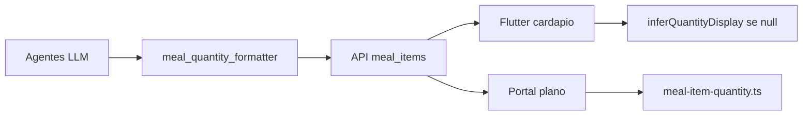

# Release: UX minimalista e qualidade do plano alimentar

Documento canônico da entrega **feature/ux-minimalista** (jun/2026). Resume o que mudou em **Flutter**, **Web**, **API** e **Agentes**, como validar e o que ficou fora de escopo.

Repositórios envolvidos:

| Repo | Branch | PR → `main` |
|------|--------|-------------|
| nutriplus-frontend | `feature/ux-minimalista` | App mobile |
| nutriplus-web | `feature/ux-minimalista` | Portal paciente + admin |
| nutriplus-api | `feature/ux-minimalista` | Backend + migrations |
| nutriplus-agentes | `feature/ux-minimalista` | Geração LLM + guardrails |

---

## 1. Objetivos da entrega

1. **UX mais limpa** — menos ruído visual, copy centralizada, disclaimers enxutos.
2. **Geração de plano confiável** — feedback de progresso contínuo, navegação à aba Plano, pós-geração sem banners duplicados.
3. **Plano alinhado ao perfil** — rotina (lanche da tarde), extras visíveis, calorias próximas da meta.
4. **Quantidades legíveis** — ovos em unidades, arroz em gramas (`quantityDisplay` + fallback).
5. **Admin / beta** — flag `UNLIMITED_PLAN_REGEN` para ignorar travas de regeração e cotas.

---

## 2. Flutter (`nutriplus-frontend`)

### Geração de plano

- `PlanGeneratingNotice` — barra de progresso **contínua** (não salta só a cada etapa da API), shimmer, % animado, finalização com check em 100%.
- Banner compacto no shell **somente fora** da aba Plano; na aba Plano, card completo único.
- `MealPlanGenerationLauncher` + `MainShellNavigation` — ao gerar, vai para aba **Plano**.
- `PlanGenerationController` — polling, fase `finishing`, auto-`acknowledgeReady` se já estiver na aba Plano.

### Pós-geração (aba Plano)

- Removidos banners redundantes: "Plano disponível" duplicado, card de regen imediato, banner de proteínas na aba Plano.
- Modal de escolha de proteínas **não abre sozinho**; aviso fica na aba **Compras**.
- `PlanDayHeader` — **Meta** vs **Plano** (kcal); banner de descompasso só se diff > 12% e plano não recém-gerado.

### Perfil e regen

- `ProfileEditEligibility` — após salvar perfil, oferece regerar plano (contexto root válido).
- `FoodPreferencePicker` — chips customizados aparecem selecionados.
- `MealRoutinePicker` — copy clara: lanche da tarde = refeição; café/extras = dicas; seção extras na aba Plano (`SatietyTipsSection`).

### Quantidades humanas

- Modelo `MealItem.quantityDisplay` / `unitKind`.
- `lib/src/core/meal_item_quantity.dart` — ex.: "Ovos mexidos — **2 ovos**" (fallback offline se API não enviar display).

### Arquivos-chave

| Área | Arquivos |
|------|----------|
| Shell / progresso | `lib/src/app.dart`, `lib/src/widgets/plan_generating_notice.dart`, `lib/providers/plan_generation_controller.dart` |
| Plano | `lib/src/features/meal_plan/presentation/meal_plan_screen.dart`, `plan_day_header.dart`, `plan_target_sync.dart` |
| Quantidades | `lib/src/core/meal_item_quantity.dart` |
| Copy | `lib/src/core/app_copy.dart` |

---

## 3. Web (`nutriplus-web`)

- Paridade de copy (`app-copy.ts`), disclaimers, link IA (`nutri-ai-link`).
- Banner de geração de plano no portal (`plan-generating-banner`).
- Cardápio: `formatMealItemLine(item)` com `quantityDisplay` (`meal-item-quantity.ts`).
- Skeleton e polish em dashboard, meal-plan, onboarding.

---

## 4. API (`nutriplus-api`)

### Migrations

| Versão | Conteúdo |
|--------|----------|
| **V50** | Feature flag `UNLIMITED_PLAN_REGEN` |
| **V51** | Descrição atualizada da flag |
| **V52** | `meal_items.quantity_display`, `meal_items.unit_kind` |

### Política de regeração

- `PlanRegenerationPolicyService` — motivo `UNLOCKED_REGEN` quando flag ativa; bypass travas (15 dias, correção única).
- `MealPlanGenerationQuotaService` — bypass cotas beta (2/dia) e demais quando flag ativa.

### Meal items

- `MealItem` entity + `MealItemResponse` + `AiMealItemDto` com `quantityDisplay` / `unitKind`.
- `MealPlanGenerationProcessor` persiste campos vindos dos agentes.

Detalhes de travas: [PLAN_REGENERATION.md](./PLAN_REGENERATION.md).

---

## 5. Agentes (`nutriplus-agentes`)

### Qualidade do plano

- `_ensure_routine_meals` — garante `AFTERNOON_SNACK` quando `eats_afternoon_snack=true`.
- `align_plan_to_target` — escala porções para meta calórica ±12%; recalcula totais pela soma dos itens.
- Guardrail `validate_calorie_alignment` em `guardrails.py`.

### Quantidades humanas

- `MealItemDto.quantity_display`, `unit_kind`.
- `app/meal_quantity_formatter.py` — normalização pós-LLM (ovos, fatias, frutas, gramas).
- Prompt LLM atualizado para pedir display + gramas.

### Mock / testes

- `tests/test_meal_quantity_formatter.py`
- `tests/test_meal_plan_mock.py` — afternoon snack, alinhamento calórico

---

## 6. Fluxo de dados (quantidades)

- **Fonte de verdade para macros:** `quantity_g`.
- **Exibição:** `quantity_display` (persistido) ou inferência client-side.

---

## 7. Feature flag admin

**`UNLIMITED_PLAN_REGEN`** (admin → Feature flags):

- Ignora cooldown 15 dias e limite de correção única.
- Ignora cotas de geração (2/dia beta, etc.).
- Uso: homologação / demos; **não** deixar ligada em produção sem controle.

Requer API reiniciada após migrations V50–V52.

---

## 8. Fora de escopo (backlog)

| Item | Status |
|------|--------|
| Bioimpedância por foto (OCR/vision) | Backlog — entrada manual hoje |
| Edição de porção pelo usuário no app | Backlog |
| Backfill SQL de `quantity_display` em planos antigos | Opcional — fallback client cobre |
| Aba Hoje exibir quantidades formatadas | Backlog |

---

## 9. Como validar (checklist)

1. Admin: ligar **Regeneração livre de plano**; reiniciar API.
2. Editar preferências (dislike banana, lanche da tarde) → Salvar → **Gerar novo plano**.
3. Aba Plano: **uma** barra de progresso; ao concluir, cardápio sem pilha de banners.
4. Cardápio: ovos/unidades legíveis; arroz/frango em `g`; extras na seção "Extras liberados".
5. Header: Meta vs Plano; superávit explicado no perfil (ganho de massa).
6. Compras: banner de proteínas se pendente (sem modal automático na geração).
7. Regenerar plano → total do cardápio dentro de ~±12% da meta calórica do perfil.

---

## 10. Testes automatizados

| Repo | Comando |
|------|---------|
| Agentes | `pytest tests/test_meal_quantity_formatter.py tests/test_meal_plan_mock.py` |
| Flutter | `flutter test test/meal_item_quantity_test.dart test/plan_meal_utils_test.dart` |
| API | `./mvnw test` (incl. `PlanRegenerationPolicyServiceTest`, `MealPlanFlowIntegrationTest`) |

---

## Histórico de planos de implementação

Esta release consolida trabalho mapeado em sessões de produto/engenharia (jun/2026):

1. **UX minimalista** — disclaimers, onboarding, plano.
2. **Bugs do Plano** — banner duplicado, café da tarde, meta vs TDEE, pós-geração.
3. **Progresso contínuo** — barra animada na geração.
4. **Quantidades por unidade** — pipeline completo `quantityDisplay`.

Atualize este arquivo quando novas entregas forem mergeadas em `main`.
