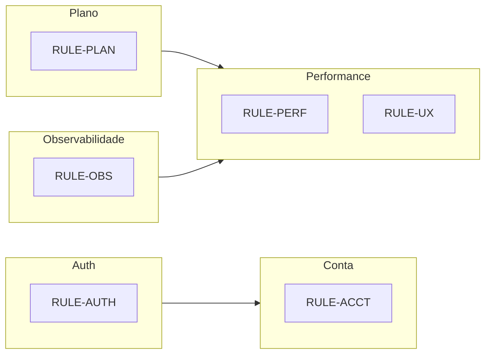

# Mapa de regras — Nutri+ Platform

Índice mestre de **regras de negócio, políticas e guardrails** implementados na plataforma. Use os IDs (`RULE-*`) em PRs, postmortems e tickets.

> **Manutenção:** ao adicionar regra de produto ou política técnica, registre aqui e link para o doc detalhado.

**Documentos relacionados:** [C4.md](./C4.md) · [FEATURES.md](./FEATURES.md) · [LATENCY_GUARDRAILS.md](./LATENCY_GUARDRAILS.md) · [ACCOUNT_LIFECYCLE.md](./ACCOUNT_LIFECYCLE.md) · [PLAN_REGENERATION.md](./PLAN_REGENERATION.md)

---

## Como ler este mapa

| Coluna | Significado |
|--------|-------------|
| **ID** | Identificador estável para referência cruzada |
| **Regra** | O que o sistema garante ou proíbe |
| **Camadas** | Onde se aplica: API, Flutter, Web, Agentes |
| **Doc** | Detalhamento |
| **Código** | Ponto de entrada principal |

---

## Auth e sessão

| ID | Regra | Camadas | Doc | Código |
|----|-------|---------|-----|--------|
| RULE-AUTH-001 | Login exige JWT válido em rotas autenticadas | API | [SECURITY.md](./SECURITY.md) | `JwtAuthenticationFilter` |
| RULE-AUTH-002 | Refresh token renova access sem re-login | API, Flutter, Web | [SECURITY.md](./SECURITY.md) | `POST /auth/refresh` |
| RULE-AUTH-003 | Conta com `loginEnabled=false` não entra (beta/waitlist) | API | [SECURITY.md](./SECURITY.md) | `LoginAccessPolicy` |
| RULE-AUTH-004 | Conta rejeitada (`accessRejected`) recebe mensagem específica | API | [SECURITY.md](./SECURITY.md) | `LoginAccessPolicy.REJECTED_MESSAGE` |
| RULE-AUTH-005 | Conta **congelada** bloqueia login normal; reativação via `POST /auth/reactivate-account` | API, Web | [ACCOUNT_LIFECYCLE.md](./ACCOUNT_LIFECYCLE.md) | `LoginAccessPolicy.FROZEN_MESSAGE` |
| RULE-AUTH-006 | Rate limit e lockout em tentativas de login | API | [SECURITY.md](./SECURITY.md) | `AuthService` |

---

## Ciclo de vida da conta

| ID | Regra | Camadas | Doc | Código |
|----|-------|---------|-----|--------|
| RULE-ACCT-001 | Congelar conta só via portal web (`WebPortalClientVerifier`) | API, Web | [ACCOUNT_LIFECYCLE.md](./ACCOUNT_LIFECYCLE.md) | `POST /users/me/freeze` |
| RULE-ACCT-002 | Congelar exige senha + e-mail (mesmo contrato de delete) | API | [ACCOUNT_LIFECYCLE.md](./ACCOUNT_LIFECYCLE.md) | `AccountConfirmationSupport` |
| RULE-ACCT-003 | Ao congelar: `account_frozen_at` setado, `loginEnabled=false`, renovação MP cancelada silenciosamente | API | [ACCOUNT_LIFECYCLE.md](./ACCOUNT_LIFECYCLE.md) | `FreezeAccountUseCase` |
| RULE-ACCT-004 | Nutricionista com care **ACTIVE** não pode congelar | API | [ACCOUNT_LIFECYCLE.md](./ACCOUNT_LIFECYCLE.md) | `FreezeAccountUseCase.ensureCanFreeze` |
| RULE-ACCT-005 | Admin não congela por este endpoint | API | [ACCOUNT_LIFECYCLE.md](./ACCOUNT_LIFECYCLE.md) | `FreezeAccountUseCase` |
| RULE-ACCT-006 | Purge automático após **90 dias** congelada | API | [ACCOUNT_LIFECYCLE.md](./ACCOUNT_LIFECYCLE.md) | `AccountPurgeScheduler` |
| RULE-ACCT-007 | Hard delete (`DELETE /users/me`) também exige portal web | API, Web | [COMPLIANCE.md](./COMPLIANCE.md) | `UserController.deleteAccount` |

---

## Plano alimentar e regeração

| ID | Regra | Camadas | Doc | Código |
|----|-------|---------|-----|--------|
| RULE-PLAN-001 | Geração passa por política + cota antes de enfileirar | API | [PLAN_REGENERATION.md](./PLAN_REGENERATION.md) | `MealPlanService.enqueueGeneration` |
| RULE-PLAN-002 | Após plano COMPLETED: lock de regeração = hoje + 15 dias | API | [PLAN_REGENERATION.md](./PLAN_REGENERATION.md) | `PlanRegenerationPolicyService` |
| RULE-PLAN-003 | `ONE_TIME_CORRECTION` consumível uma vez por usuário | API, Flutter, Web | [PLAN_REGENERATION.md](./PLAN_REGENERATION.md) | V48 fields |
| RULE-PLAN-004 | `CYCLE_REVIEW` exige `reviewId` + `planChangeSuggested` | API, Flutter | [PROGRESS_ANALYSIS.md](./PROGRESS_ANALYSIS.md) | `POST /progress/reviews` |
| RULE-PLAN-005 | **`PLAN_RESET`**: apaga tracking da era atual, mantém histórico, reinicia ciclo 15d, **não** consome correção única | API, Flutter, Web | [PLAN_REGENERATION.md](./PLAN_REGENERATION.md) | `PlanResetService` |
| RULE-PLAN-006 | Reset destrutivo exige confirmação UI (checkbox + digitar `ZERAR PLANO`) | Flutter, Web | [CLIENT_LOADING_UX.md](./CLIENT_LOADING_UX.md) | `PlanResetConfirmDialog` |
| RULE-PLAN-007 | `GENERATION_RETRY` não consome flags de produto | API | [PLAN_REGENERATION.md](./PLAN_REGENERATION.md) | `PlanRegenerationReason.GENERATION_RETRY` |
| RULE-PLAN-008 | Flag `UNLIMITED_PLAN_REGEN` bypassa locks de produto (dev/homolog) | API, Flutter, Web | [PLAN_REGENERATION.md](./PLAN_REGENERATION.md) | `FeatureFlagCodes.unlimitedPlanRegen` |
| RULE-PLAN-009 | `UNLOCKED_REGEN` reason quando elegível após desbloqueio | API | [PLAN_REGENERATION.md](./PLAN_REGENERATION.md) | `PlanRegenerationReasons.unlockedRegen` |

---

## Saúde e elegibilidade IA

| ID | Regra | Camadas | Doc | Código |
|----|-------|---------|-----|--------|
| RULE-HEALTH-001 | `ai_plan_eligible=false` bloqueia geração automática | API, Flutter, Web | [HEALTH_ELIGIBILITY.md](./HEALTH_ELIGIBILITY.md) | `PlanRegenerationEligibility` |
| RULE-HEALTH-002 | Edição de perfil que afeta plano respeita lock de 15 dias | Flutter, Web | [HEALTH_ELIGIBILITY.md](./HEALTH_ELIGIBILITY.md) | `ProfileEditEligibility` |
| RULE-HEALTH-003 | Disclaimer IA obrigatório — produto não substitui nutricionista | Todos | [legal/AI_DISCLOSURE.md](./legal/AI_DISCLOSURE.md) | UI copy |

---

## Check-ins e aderência

| ID | Regra | Camadas | Doc | Código |
|----|-------|---------|-----|--------|
| RULE-CHK-001 | Check-in por refeição: DONE ou SKIPPED | API, Flutter | [ENGAGEMENT.md](./ENGAGEMENT.md) | `CheckinService` |
| RULE-CHK-002 | Extras fora do plano somam calorias (e carbs em low carb) | API, Flutter | [ENGAGEMENT.md](./ENGAGEMENT.md) | `POST /checkins/extras` |
| RULE-CHK-003 | UI otimista no toggle de check-in; reverte em erro | Flutter | [CLIENT_LOADING_UX.md](./CLIENT_LOADING_UX.md) | `TodayScreen._toggleCheckin` |
| RULE-CHK-004 | Streak e aderência semanal via stats | API, Flutter | [ENGAGEMENT.md](./ENGAGEMENT.md) | `GET /checkins/stats` |

---

## Assinatura B2C (atleta)

| ID | Regra | Camadas | Doc | Código |
|----|-------|---------|-----|--------|
| RULE-SUB-001 | Trial e renovação via Mercado Pago | API | [SUBSCRIPTIONS.md](./SUBSCRIPTIONS.md) | `SubscriptionService` |
| RULE-SUB-002 | Cancelamento mantém acesso até fim do período (`CANCELLED_PENDING`) | API, Flutter, Web | [SUBSCRIPTIONS.md](./SUBSCRIPTIONS.md) | `POST /payments/subscription/cancel` |
| RULE-SUB-003 | Reativar renovação enquanto pendente | API, Flutter | [SUBSCRIPTIONS.md](./SUBSCRIPTIONS.md) | `POST /payments/subscription/reactivate` |
| RULE-SUB-004 | Botões cancelar/reativar mostram busy state | Flutter | [CLIENT_LOADING_UX.md](./CLIENT_LOADING_UX.md) | `SubscriptionScreen` |

---

## Nutri+ Pro / marketplace

| ID | Regra | Camadas | Doc | Código |
|----|-------|---------|-----|--------|
| RULE-PRO-001 | Nutricionista CRN no marketplace | API, Web | [NUTRI_PLUS_PRO.md](./NUTRI_PLUS_PRO.md) | `MarketplaceController` |
| RULE-PRO-002 | Care relationship ACTIVE necessário para chat | API, Web | [NUTRI_PLUS_PRO.md](./NUTRI_PLUS_PRO.md) | `CareController` |
| RULE-PRO-003 | Pagamento consulta via Stripe | API, Web | [NUTRI_PLUS_PRO.md](./NUTRI_PLUS_PRO.md) | Stripe webhooks |

---

## Performance (API)

| ID | Regra | Camadas | Doc | Código |
|----|-------|---------|-----|--------|
| RULE-PERF-S1 | Tier **S** p95 < 200 ms (bootstrap, checkins, readonly) | API | [PERFORMANCE.md](./PERFORMANCE.md) | `@Cacheable`, índices |
| RULE-PERF-A1 | Tier **A** p95 < 500 ms (auth, writes leves) | API | [PERFORMANCE.md](./PERFORMANCE.md) | — |
| RULE-PERF-B1 | Tier **B** p95 < 2 s (macros, swaps) | API | [PERFORMANCE.md](./PERFORMANCE.md) | — |
| RULE-PERF-C1 | Tier **C** p95 < 30 s (geração plano async) | API, Agentes | [PERFORMANCE.md](./PERFORMANCE.md) | Job queue |
| RULE-PERF-002 | Proibido N+1 em listas com filhos | API | [LATENCY_GUARDRAILS.md](./LATENCY_GUARDRAILS.md) | `MealLoader` pattern |
| RULE-PERF-003 | Regressão máxima ×1.2 vs baseline warm | API | [PERFORMANCE_BASELINE.md](./PERFORMANCE_BASELINE.md) | `./perf/run-baseline.sh` |
| RULE-PERF-004 | Migrations MySQL: sem `SERIAL`/`RETURNING` | API | [postmortems/2026-07-01-flyway-v57-mysql-syntax.md](./postmortems/2026-07-01-flyway-v57-mysql-syntax.md) | `db/migration/*.sql` |

---

## Cliente — loading e latência

| ID | Regra | Camadas | Doc | Código |
|----|-------|---------|-----|--------|
| RULE-UX-A1 | Tier A: optimistic UI; spinner só se >300 ms | Flutter | [CLIENT_LOADING_UX.md](./CLIENT_LOADING_UX.md) | `TodayScreen` |
| RULE-UX-B1 | Tier B: botão `isBusy` + disable | Flutter, Web | [CLIENT_LOADING_UX.md](./CLIENT_LOADING_UX.md) | `NutriBusyButton` |
| RULE-UX-C1 | Tier C: navegar → aba Plano → `PlanGeneratingNotice`; **sem** overlay global | Flutter | [CLIENT_LOADING_UX.md](./CLIENT_LOADING_UX.md) | `meal_plan_generation_launcher` |
| RULE-UX-002 | ≤ 3 requests no first paint de tela | Flutter, Web | [LATENCY_GUARDRAILS.md](./LATENCY_GUARDRAILS.md) | — |
| RULE-UX-003 | Polling chat mínimo **8 s** | Flutter, Web | [LATENCY_GUARDRAILS.md](./LATENCY_GUARDRAILS.md) | — |
| RULE-UX-004 | Preferir `GET /app/bootstrap` ou `Promise.all` no login | Flutter, Web | [CLIENT_LOADING_UX.md](./CLIENT_LOADING_UX.md) | `AppDataStore` |
| RULE-UX-005 | Nunca renderizar corpo vazio na aba Plano (`SizedBox.shrink`) | Flutter | [CLIENT_LOADING_UX.md](./CLIENT_LOADING_UX.md) | `MealPlanScreen` |
| RULE-UX-006 | `mealPlanRevision` bump quando plano muda (inclui null pós-reset) | Flutter | [CLIENT_LOADING_UX.md](./CLIENT_LOADING_UX.md) | `AppDataStore._applyBootstrap` |

---

## Agentes IA

| ID | Regra | Camadas | Doc | Código |
|----|-------|---------|-----|--------|
| RULE-AG-001 | Payload enxuto — só campos usados no prompt | Agentes | [LATENCY_GUARDRAILS.md](./LATENCY_GUARDRAILS.md) | `meal_plan_generator.py` |
| RULE-AG-002 | Pós-processamento O(n) sobre refeições | Agentes | [LATENCY_GUARDRAILS.md](./LATENCY_GUARDRAILS.md) | scrub/rebalance |
| RULE-AG-003 | Schema API ↔ agente sobem juntos | API, Agentes | [INTEGRATIONS.md](./INTEGRATIONS.md) | contrato JSON |
| RULE-AG-004 | Pipeline secundário: Luna/Bruno → guardrails → Flora/Helena/Mercado/Evandro | Agentes | [nutriplus-agentes/docs/SECONDARY_AGENTS.md](../../nutriplus-agentes/docs/SECONDARY_AGENTS.md) | `registry.py` |

---

## Observabilidade

| ID | Regra | Camadas | Doc | Código |
|----|-------|---------|-----|--------|
| RULE-OBS-001 | Todo request HTTP propaga `X-Correlation-Id`, `X-Trace-Id`, `X-Flow-Id`, `X-Session-Id` | Todos | [OBSERVABILITY.md](./OBSERVABILITY.md) | filters + `TraceService` |
| RULE-OBS-002 | Erro JSON inclui `correlationId` para suporte | API, clientes | [OBSERVABILITY.md](./OBSERVABILITY.md) | `ApiExceptionHandler` |
| RULE-OBS-003 | New Relic: bridge defensivo se agent ausente | API | [observability/NEW_RELIC.md](./observability/NEW_RELIC.md) | `NewRelicTraceBridge` |
| RULE-OBS-004 | Idempotency-Key em mutações críticas | API, Flutter | [OBSERVABILITY.md](./OBSERVABILITY.md) | `IdempotencyFilter` |

---

## Feature flags (seleção)

| ID | Regra | Camadas | Doc | Código |
|----|-------|---------|-----|--------|
| RULE-FF-001 | `UNLIMITED_PLAN_REGEN` — bypass locks regeração | API, clientes | [RELEASE_UX_MINIMALISTA.md](./RELEASE_UX_MINIMALISTA.md) | feature flags endpoint |
| RULE-FF-002 | Billing enabled gate no catálogo | API, Flutter, Web | [SUBSCRIPTIONS.md](./SUBSCRIPTIONS.md) | `catalogBillingEnabled` |

---

## Diagrama — domínios de regra

---

## Changelog deste mapa

| Data | Mudança |
|------|---------|
| 2026-07 | Criação inicial: PLAN_RESET, account freeze, loading UX, guardrails consolidados |
