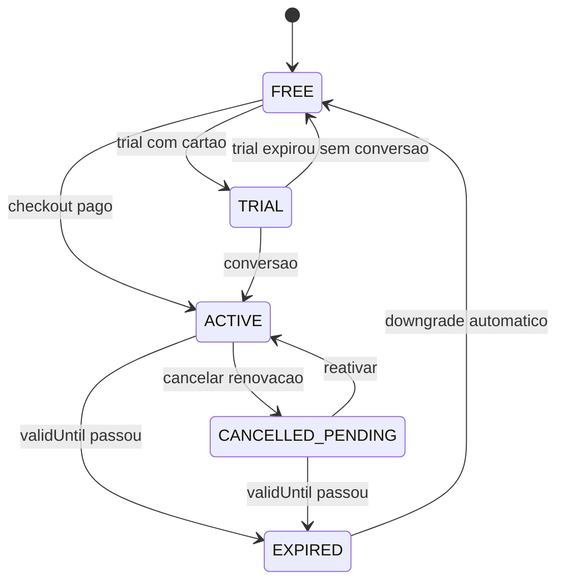

# Nutri+ — Assinaturas (estado implementado)

Documentação do **comportamento atual** do billing B2C (Essencial + Atleta). Para e-mail transacional e paywall web completo, ver [BILLING_AND_AUTH_ROADMAP.md](./BILLING_AND_AUTH_ROADMAP.md).

Negócio: [BUSINESS_MODEL.md](./BUSINESS_MODEL.md). Preços: [PRICING.md](./PRICING.md). Setup MP: [MERCADOPAGO_SETUP.md](./MERCADOPAGO_SETUP.md).

---

## Planos

| Plano | Enum | Descrição |
|-------|------|-----------|
| Grátis | `FREE` | 1 geração de plano/mês (com billing ativo), check-ins, evolução |
| Essencial mensal | `ESSENTIAL_MONTHLY` | Plano IA + 1 regeneração/mês |
| Essencial anual | `ESSENTIAL_YEARLY` | Essencial com desconto anual |
| Atleta mensal | `ATHLETE_MONTHLY` | Essencial + treinos + regens ilimitadas |
| Atleta anual | `ATHLETE_YEARLY` | Atleta com desconto anual |

Catálogo: `subscription_plan_catalog` + admin `/admin/subscription-plans`.

Preços default (V45): Essencial R$ 19,90 / R$ 179 ano; Atleta R$ 29,90 / R$ 269 ano.

---

## Limites de geração de plano

Serviço: `MealPlanGenerationQuotaService`.

| Tier | Regenerações/mês |
|------|------------------|
| Grátis (billing on) | 1 |
| Essencial | 1 |
| Atleta | Ilimitado |
| Trial | Ilimitado |
| Beta (billing off) | Ilimitado |

Excesso retorna **402** `SUBSCRIPTION_REQUIRED`.

---

## Status da assinatura

| Status | Significado |
|--------|-------------|
| `NONE` | Sem assinatura paga |
| `TRIAL` | Período trial ativo (`trialAte`) |
| `ACTIVE` | Assinatura paga, renovação automática |
| `CANCELLED_PENDING` | Cancelou renovação; acesso até `validUntil` |
| `EXPIRED` | Período encerrado |

Implementação: `SubscriptionService.statusAssinatura()`.

---

## Fluxos

### Assinar

1. Cliente chama `GET /plans` (catálogo + `billingEnabled`)
2. `POST /payments/checkout` com plano desejado
3. Redirect Mercado Pago (ou mock se `MERCADOPAGO_MOCK_MODE=true`)
4. Webhook ou `POST /payments/checkout/sync` confirma pagamento
5. `SubscriptionService.ativarPeriodoPago()` — define plano, `planValidUntil`, `autoRenew=true`
6. Modo atleta ativado **somente** se plano Atleta (`SubscriptionPlans.isAthletePlan`)

### Trial

- `POST /payments/trial` (via `TrialController`)
- Exige cartão cadastrado
- 7 dias com **acesso completo** (Essencial + Atleta)
- Ao expirar: cobrança automática **Essencial Mensal** (R$ 19,90) ou downgrade para FREE

### Cancelar renovação

- `POST /payments/subscription/cancel`
- Define `autoRenew=false`, `planCancelledAt=now`
- **Não revoga acesso imediato** — usuário usa até `planValidUntil`
- Status → `CANCELLED_PENDING`

### Reativar renovação

- `POST /payments/subscription/reactivate`
- Só se `planCancelledAt != null` e período ainda válido
- Restaura `autoRenew=true`, limpa `planCancelledAt`

### Upgrade mensal → anual

- `GET /payments/quote?plan=ATHLETE_YEARLY`
- Cobrança proporcional: diferença de preço × dias restantes / 30
- `SubscriptionService.ehUpgradeProporcional()` + `calcularValorCobranca()`

### Expiração

- Scheduler verifica `planValidUntil`
- Se expirado: downgrade para `FREE`, desativa modo atleta
- **Grace period:** usuários com atleta ativo antes do deploy de billing recebem `athlete_grace_until` (30 dias)

---

## Feature flag: paywall

| Flag | Efeito |
|------|--------|
| `SUBSCRIPTION_BILLING` **off** | Modo atleta liberado sem pagamento (beta) |
| `SUBSCRIPTION_BILLING` **on** | `TrainingService.saveProfile(athleteModeEnabled=true)` retorna **402** se sem assinatura/trial/grace |

Admin: `GET/PATCH /admin/feature-flags/{code}`.

Durante beta: manter flag **desligada**. Ver [MERCADOPAGO_SETUP.md](./MERCADOPAGO_SETUP.md).

---

## Endpoints

| Método | Rota | Função |
|--------|------|--------|
| GET | `/plans` | Catálogo + billingEnabled |
| GET | `/payments/config` | Config MP (public key, mock) |
| GET | `/payments/subscription` | Status atual |
| GET | `/payments/quote` | Cotação (upgrade) |
| POST | `/payments/checkout` | Iniciar checkout |
| POST | `/payments/checkout/sync` | Sync pós-redirect |
| POST | `/payments/charge` | Cobrança direta (renovação) |
| POST | `/payments/trial` | Iniciar trial |
| POST | `/payments/subscription/cancel` | Cancelar renovação |
| POST | `/payments/subscription/reactivate` | Reativar renovação |
| GET/POST | `/payments/mercadopago/webhook` | Webhook MP |
| GET | `/payments/history` | Histórico pagamentos |
| GET/POST/DELETE | `/payments/cards` | Cartões salvos |

Admin planos: `GET/PATCH /admin/subscription-plans/{id}`.

---

## Paridade entre clientes

| Ação | Flutter | Web Angular |
|------|---------|-------------|
| Ver status | `SubscriptionScreen` | `portal-subscription` |
| Ver planos / assinar | `PlansScreen` + `CheckoutScreen` | `PlanCatalogComponent` |
| Cancelar renovação | Sim | Sim |
| Reativar renovação | **Não** | Sim |
| Trial | **Não** | Sim (`card-register`) |
| Cadastrar cartão | **Não** | `/app/cobranca` |

Gap prioritário: adicionar reativar no Flutter (`POST /payments/subscription/reactivate` já existe na API).

---

## Mock mode (desenvolvimento)

Com `MERCADOPAGO_MOCK_MODE=true`:

- Checkout ativa plano localmente sem MP real
- Útil para testes E2E e demos

---

## Diagrama de estados

---

## Manutenção

Alterações em billing devem atualizar **este documento** (estado atual). Roadmap futuro vai em [BILLING_AND_AUTH_ROADMAP.md](./BILLING_AND_AUTH_ROADMAP.md).
